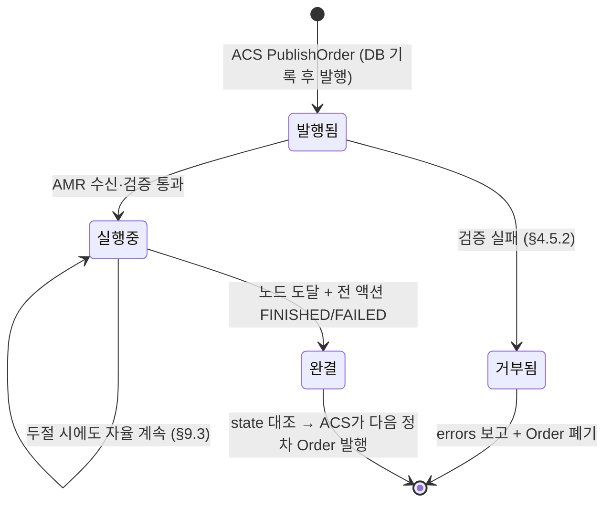
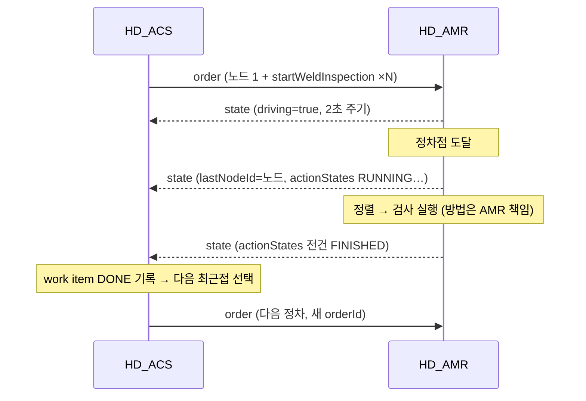
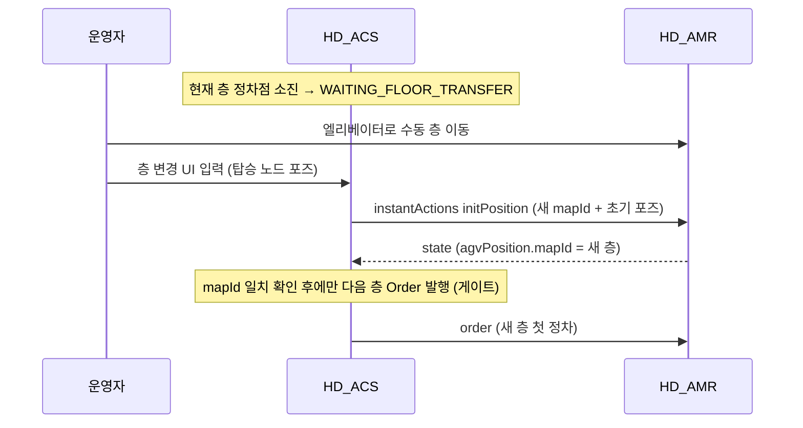

# HD_ACS ↔ HD_AMR VDA 5050 인터페이스 사양서

| 항목 | 내용 |
|---|---|
| 문서 버전 | **1.3** |
| 작성일 | 2026-08-27 (최종 개정 2026-09-03) |
| 대상 | HD_AMR 통합 운영 S/W 개발팀 (로봇 온보드) |
| 기준 표준 | **VDA 5050 v2.0** (Interface for the communication between AGV and master control) |
| 상태 | **확정** — N10(정차 이격)만 잠정값 유지. N12(ACS 생존 신호)는 2026-09-03 승인. N13(검사 타입 카탈로그)은 2026-09-14 제안(계약 무변경) |
| 개정 1.1 | 2026-09-01 — 로봇(TARS-M) REST 실물 스펙 확보분 반영. **ACS↔AMR 계약(§1~§9·부록 A~C)은 무변경**이며, AMR 온보드가 그 계약을 로봇 REST로 어떻게 이행하는지를 **부록 D**로 신설하고 관련 절에 각주를 달았다. 에러코드 매핑·층 전환 절차는 로봇측 정보 미확보로 **보류**(§6.4·§5.2·§9.2 그대로 유효, 구현만 유보) |
| 개정 1.2 | 2026-09-03 — ACS 프로세스 생존 상태를 HD_AMR에 알리는 ACS 전용 `connection` 토픽과 Last Will 사양 추가. **VDA 5050 표준 확장·승인 완료** `[N12]` |
| 개정 1.3 | 2026-09-14 — §8.5 검사 타입 카탈로그·레시피 계약(제안) 신설 + **§8.5.1 `seamType`×`wall_code`→레시피 매핑 규칙(제안)**, §10 `[N13]` 등재 + **부록 D.3 경유점 `Surface` 유도(온보드 구현, HD_AMR 코드 근거)** |
| 개정 1.3a | 2026-09-14 — **`seamType` enum 확장 ACS 선반영**: 계획 UI(③ 검사 작업 등록) seamType 드롭다운 추가에 맞춰 §8.1/§8.2·등록 게이트·`param_schema`가 `LINE`·`CROSS`·`CORNER`를 수용·발행(`POLYLINE` 거부). **`CROSS`/`CORNER`는 HD_AMR 실행 미구현(스텁) — 계획 데이터 전달만**, 레시피 실행은 N13 확정 후 2차 연동 |

> **이 문서가 인터페이스 계약의 단일 출처(single source of truth)다.**
> 다른 문서(ARCHITECTURE.md, GRAPH_DATA_MODEL.md, SPEC_PHASE2_ACS.md 등)와 기술이 다를 경우 본 사양서가 우선한다.
> 본문은 **계약**을 기술하며, 현행 ACS 구현이 계약과 다른 곳은 각주 `※구현`으로 구분 표기한다.

---

## 1. 개요·범위

### 1.1 단일 상대 원칙 [ADR-001]

HD_ACS(관제)의 로봇측 통신 상대는 **HD_AMR 하나**, 인터페이스는 **VDA 5050 over MQTT 하나**뿐이다.
ACS는 AMR 플랫폼·협동로봇·검사장비를 개별 제어하지 않으며, 자세·검사 시퀀스를 계산하지 않는다.

### 1.2 책임 경계

| | HD_ACS (마스터 컨트롤) | HD_AMR (로봇 온보드) |
|---|---|---|
| 계획 | 검사 시나리오·영역·작업 정의, 정차점·정차각 산출(맵 좌표) | — |
| 배차 | Order 생성·발행(어디로 가서 무엇을 검사할지) | — |
| 실행 | — | 주행, 협동로봇 자세 시퀀스, 검사장비 제어, 검사 실행 방법 일체 |
| 자세 | 전송하지 않음 (Cobot BASE 좌표·티칭 데이터 미전송) | `wall_code` 티칭 기반 툴 자세 결정 |
| 보고 | state 수신·대조·기록·전파 | state 주기 보고, connection 생존 신호 |
| 데이터 | 촬영 명령의 위치·시각·성공/실패 기록 | 이미지 자체는 별도 검사 S/W로 (ACS 미경유) [ADR-004] |

### 1.3 채택 버전

- **VDA 5050 2.0** — 헤더 `version: "2.0.0"`, 토픽 majorVersion `v2`.
- 표준에 없는 검사 동작은 **커스텀 액션**으로 정의한다 (§8).

---

## 2. 전송 계층 (MQTT)

### 2.1 브로커

| 항목 | 값 |
|---|---|
| 브로커 | Mosquitto (현장 이동식 서버 내 배치, 폐쇄망) [ADR-011] |
| 포트 | 1883 (TCP, 평문 — 폐쇄망 전제. TLS/인증 도입 여부 `[협의]`) |
| 클라이언트 ID | ACS: `hd-acs-master` / AMR: 로봇별 고유 ID |

### 2.2 토픽 구조

```
{interfaceName}/{majorVersion}/{manufacturer}/{serialNumber}/{channel}
```

- `interfaceName` = **`uagv`** (고정)
- `majorVersion` = **`v2`** (고정)
- `manufacturer` / `serialNumber` = ACS DB `ref.robot` 등록값과 동일해야 함 (예: `HHI` / `AMR-01`)

예: `uagv/v2/HHI/AMR-01/order`

### 2.3 채널 목록·방향·QoS·retain

| channel | 방향 | QoS | retain | 비고 |
|---|---|---|---|---|
| `order` | ACS → AMR | 1 (AtLeastOnce) | false | 주행+검사 명령 (§4) |
| `instantActions` | ACS → AMR | 1 | false | 즉시 액션 (§5) |
| `state` | AMR → ACS | 1 | false | **2초 주기** + 이벤트 시 즉시 (§6) |
| `connection` | AMR → ACS | 1 | **true** | 생존 신호 + MQTT Last Will (§7) |
| `connection` (ACS identity) | ACS → AMR | 1 | **true** | ACS 전용 identity의 생존 신호 + MQTT Last Will (§7.2) `[N12]` |
| `factsheet` | AMR → ACS | — | — | **예약 채널 (현행 미사용)** — 향후 로봇 능력 조회용. 현행 ACS는 발행/구독하지 않음 |
| `visualization` | — | — | — | **미사용** — 위치는 state.agvPosition으로 충분 (2초 주기) |

### 2.4 Last Will (필수)

AMR은 MQTT 접속 시 다음 Will을 반드시 설정한다:

- Will 토픽: 자신의 `connection` 토픽
- Will payload: `connectionState: "CONNECTIONBROKEN"` 인 connection 메시지
- Will retain: **true**, QoS 1

→ Wi-Fi 두절·프로세스 사망 시 브로커가 대신 CONNECTIONBROKEN을 발행하여 ACS가 두절을 감지한다 [ADR-002].

> ※구현: 시뮬레이터(`HD.Acs.Simulator/Program.cs:46-51`)가 이 규약대로 동작. Will payload의 headerId/timestamp는 접속 시점 값이어도 무방(ACS는 connectionState만 소비).

ACS도 MQTT 접속 시 ACS 전용 `connection` 토픽에 다음 Will을 설정한다 `[N12]`:

- Will 토픽: `uagv/v2/HD_ACS/hd-acs-master/connection`
- Will payload: `connectionState: "CONNECTIONBROKEN"` 인 §7.2 메시지
- Will retain: **true**, QoS 1

ACS 생존 토픽은 로봇별 토픽이 아니라 **ACS 인스턴스당 하나**다. 따라서 여러 AMR이 동일 토픽을 구독하며,
AMR 수가 늘어나도 ACS MQTT 연결과 Will은 추가하지 않는다.

---

## 3. 공통 메시지 헤더

모든 채널의 payload는 JSON 객체이며 다음 헤더 필드로 시작한다:

```json
{
  "headerId": 42,
  "timestamp": "2026-08-27T04:12:33.427Z",
  "version": "2.0.0",
  "manufacturer": "HHI",
  "serialNumber": "AMR-01"
}
```

| 필드 | 규칙 |
|---|---|
| `headerId` | **토픽별 단조 증가** (uint, 발행 측이 채번) `[협의 N1]` |
| `timestamp` | ISO 8601 UTC. **밀리초 3자리 + `Z`** 형식 권장 `[협의 N2]`. 수신 측은 ISO 8601 오프셋 표기(`+00:00`, 소수 7자리 포함)도 수용해야 한다 |
| `version` | `"2.0.0"` 고정 |
| `manufacturer`, `serialNumber` | 토픽 경로 요소와 동일 값 |

> ※구현(2026-08-28 반영 완료): ACS는 headerId를 **토픽별 단조 증가**로 채번하고 timestamp를 **밀리초+`Z`** 포맷으로 발행한다 — ACS 제안값(N1/N2) 그대로 구현됨. 수신 측은 여전히 오프셋 표기도 수용해야 한다(§3 표).

---

## 4. order (ACS → AMR)

### 4.1 배차 모델 — 정차 단위 단일 노드 Order

ACS는 **greedy 최근접 동적 배차**를 사용한다. 층(맵) 안의 미검사 정차점 중 로봇 최근접 1건을 골라
**노드 1개짜리 Order**를 발행하고, 그 정차의 모든 액션이 종결되면 다음 정차 Order를 발행한다.

- **Order 1건 = 정차점 1개 = OrderNode 1개 (sequenceId=0) + 검사 액션 N개**
- **orderId**: 정차마다 **새 UUID** 발급 (이전 Order는 이미 완결된 상태에서만 다음 Order 수신)
- **orderUpdateId**: 항상 **0** — order update(동일 orderId 갱신) 시맨틱은 사용하지 않는다.
  재시도·변경도 **신규 orderId의 새 Order**로 발행한다
- **released**: 모든 노드/엣지 `true` (Base 전체 릴리즈, **horizon 미사용**) [ADR-002]
- 경로(엣지 시퀀스)는 전송하지 않는다 — 목표 노드까지의 주행 경로는 AMR 자율 판단

> AMR 요건: "현재 Order와 다른 orderId 수신 = 새 임무"로 처리할 것. 이전 Order의 액션이 모두 종결된 뒤에만 새 Order가 오는 것이 ACS 보증이나, 방어적으로는 신규 orderId 수신 시 이전 Order를 폐기해도 무방하다(비상정지·수동 개입 후 재배차 경로).

복수 노드 Order(경로형: sequenceId 노드=짝수 0,2,4… / 엣지=홀수 1,3,5…)는 ACS `OrderBuilder`에 구현되어 있으나 **현행 운영 계약은 단일 노드형**이다. 향후 경로형 전환 시 본 절을 개정한다.

> **액션 없는 Order(수동 이동)**: ACS는 이동 테스트·수동 이동용으로 `actions: []`(빈 배열)인 단일 노드 Order를 발행할 수 있다.
> AMR은 **노드 도달만으로 완결** 처리한다(actionStates는 빈 배열 유지).
> 이 경우 `theta`는 **미지정(null) 가능** — 검사 정차가 아니므로 §4.4의 "벽 정면 방향" 전제가 적용되지 않으며, 도착 방향은 자유다.

### 4.2 메시지 스키마 (ACS 발행 필드)

```jsonc
{
  // ── 공통 헤더 (§3) ──
  "headerId": 43, "timestamp": "...", "version": "2.0.0",
  "manufacturer": "HHI", "serialNumber": "AMR-01",

  "orderId": "0d9a2c9e-6a1f-4a58-9e1e-1c9f6d2b7a01",   // 정차마다 신규 UUID
  "orderUpdateId": 0,                                    // 항상 0
  "nodes": [
    {
      "nodeId": "b7f0…(workItemId UUID)",   // ACS 발급 — state.lastNodeId로 echo
      "sequenceId": 0,
      "released": true,
      "nodePosition": {
        "x": 12.482, "y": 5.117,            // 맵 좌표 [m]
        "theta": 1.571,                     // [rad], 맵 X축 기준 CCW (부록 B)
        "allowedDeviationXY": 0.08,         // [m] — 도착 판정 허용 오차 (AMR 확정: 주행 정밀도 제어 아님, 미지정 시 0.1)
        "allowedDeviationTheta": 0.07,      // [rad] — 동일 (미지정 시 0.1)
        "mapId": "CT1-L2"                   // 층 = 맵 (§4.3)
      },
      "actions": [ /* §8 커스텀 액션 */ ]
    }
  ],
  "edges": []                               // 단일 노드형 — 빈 배열
}
```

- 노드의 `actions`는 검사 액션 배열 — 같은 정차점의 작업 N개가 액션 N개로 실린다. **배열 순서 = 실행 순서.**
> **각주 (1.1)** — 로봇 REST의 이동 명령(`POST /api/v3/robot/go`)은 `{x, y, rz, stopFlag}` 4개만 받으며 **허용 오차 파라미터가 없다**.
> 즉 `allowedDeviationXY`/`allowedDeviationTheta`는 로봇에 그대로 전달할 수단이 없고, **AMR 온보드가 자체 도착 판정에만 쓰는 값**이다 —
> 2026-08-28 회신("주행 정밀도 제어가 아니라 도착 판정 허용 오차")과 정합한다. 계약 무변경. 상세는 부록 D.

- `edges`는 단일 노드형에서 항상 빈 배열. 엣지 객체가 실리는 경우 각 엣지에도 `actions: []`(빈 배열)를 포함한다 `[협의 N3]`
  (※구현 2026-08-28: OrderEdge 모델에 actions 필드 반영 완료 — 빈 배열 직렬화).

### 4.3 맵 = 층 모델

- 화물창은 4층 슬라이스 구조이며 **층 1개 = 맵 1개**: `mapId = "{tankId}-L{n}"` (예: `CT1-L1` … `CT1-L4`).
- ACS는 **로봇이 보고한 층(state.agvPosition.mapId)과 일치하는 Order만 발행**한다 (층 검증 게이트, §9.2).
- 층간 이동(엘리베이터)은 수동 운영 — ACS는 Order로 층 이동을 명령하지 않는다 [Q9].

### 4.4 정차점(nodePosition)의 의미와 산출 (참고)

ACS가 발행하는 `nodePosition`은 다음과 같이 산출된 **벽면 이격 정차점**이다 (ACS 내부 규칙이나, AMR이 목표점의 성격을 이해하는 데 필요해 기재):

```
정차점(x,y) = 검사 영역 중심의 바닥 투영 + (벽 내부향 법선의 수평 성분) × 정차 이격(standoff)
theta       = 벽을 정면으로 바라보는 방향
```

- **정차 이격(기본 0.8 m, 영역별 설정 가능)이 이미 반영되어 있다** — 목표점이 벽면에 붙어 있지 않다.
  이격 값은 "벽면 ↔ 로봇 기준점(중심)" 거리이므로, 실제 차체-벽 여유 = 이격 − 로봇 반폭 − allowedDeviationXY.
- 바닥(B)/천장(T) 영역은 수평 법선이 없어 이격 없이 중심 투영이 오며, 운영자 수동 지정 좌표가 올 수도 있다.
- **책임 경계**: ACS의 정차점은 "목표"일 뿐이며, 접근 경로 계획·장애물(벽 포함) 충돌 회피는 **AMR 자율 주행 책임**이다.
  목표점이 도달 불가하면 진입을 강행하지 말고 `state.errors`(주행 실패 유형)로 보고할 것 (§6.4, §9.5 실패 정책으로 처리).
- **검사 방향(툴 회전각) 유도 전제** (2026-08-29 AMR 회신 §5.2): AMR은 `seamStartW→seamEndW` 벡터를
  **노드 `theta`(벽 정면 방향)** 기준 벽면-로컬로 투영해 촬상 기울기를 액션별 자동 계산한다 — ACS는 방향 정보를 추가로 보내지 않는다.
  따라서 **`station_theta` 수동 오버라이드 시에도 theta는 벽 정면 방향을 유지해야** 이 유도가 성립한다.

> **각주 (1.1) — theta 보정은 로봇 이동 명령의 옵션이다.**
> `POST /robot/go` 의 `stopFlag` 는 `true` 일 때만 **정차 후 rz(=노드 theta)까지 보정**하고, `false` 면 근처를 지나며 각도를 보정하지 않는다.
> 본 절의 "벽을 정면으로 바라보는 theta" 전제와 §8.1 의 검사 방향(툴 회전각) 자동 유도는 **각도가 실제로 보정된 것을 전제**하므로,
> AMR 온보드는 **검사 정차점 주행을 항상 `stopFlag: true` 로 발행해야 한다**(부록 D). 경유점 개념은 현 계약에 없다.

> AMR 요건: 로봇 실물 치수 확정 시 적정 기본 이격을 ACS에 회신 — 코봇 리치(용접선까지 도달)와 차체-벽 안전 여유를 동시에 만족하는 값 `[협의 N10]`.

### 4.5 Order 수명주기

발행된 Order 1건의 상태 흐름과 양측 책임:



**4.5.1 상태 판정의 주체와 근거**

| 상태 | 판정 주체 | 근거 |
|---|---|---|
| 발행됨 | ACS | Order 발행 직전 DB에 정차·액션 기록 (저장 → 발행 순서) |
| 실행중 | ACS | state의 `orderId` 일치 + `driving`/`actionStates` 진행 보고 |
| 완결 | ACS | `lastNodeSequenceId` ≥ 목표 노드 seq **AND** 해당 Order의 전 액션이 FINISHED/FAILED (§6.2 대조 규칙) — "전 액션 성공"이 아니라 **전 액션 종결**이 완결 조건이며, FAILED 포함 여부는 실패 정책(§9.5)이 처리 |
| 폐기 | AMR | **신규 orderId 수신 = 이전 Order 즉시 폐기** (ACS는 이전 Order 완결 후에만 새 Order를 보내는 것을 보증하나, 비상정지·수동 개입 후 재배차 경로에서는 미완결 상태의 교체가 발생할 수 있음) |

> **각주 (1.1) — "이전 Order 폐기"는 로봇에서 자동으로 일어나지 않는다.**
> 로봇의 이동 명령 `POST /robot/go` 는 **현재 목적지를 대체하지 않고 큐에 추가(append)** 된다(벤더 회신 2.6).
> 따라서 AMR 온보드가 신규 orderId 수신 시 새 좌표로 `/robot/go` 를 곧바로 재발행하면
> 로봇은 **이전 목적지를 먼저 경유한 뒤** 새 목적지로 간다. 로봇·통신 모두 정상 동작하므로 오류로 드러나지 않고
> **검사 위치만 틀리는 형태로 조용히 실패**한다(가장 위험한 실패 유형).
> → 폐기 경로는 반드시 **`POST /robot/state`(정지) → `POST /robot/go`(신규 좌표)** 순서로 구현한다. 부록 D 참조.

**4.5.2 Order 거부(rejection)** `[협의 N11]`

AMR이 수신한 Order를 실행할 수 없는 경우(모르는 `mapId`, 필수 필드 누락, 파라미터 검증 실패, 현재 층 불일치 등):

- Order를 **폐기**하고(부분 실행 금지), 기존 실행 중 Order가 있으면 그것을 유지한다.
- `state.errors[]`에 거부 사실을 보고한다 — ACS 제안: `errorType: "orderValidationError"`(N6 코드 체계와 함께 확정), `errorLevel: "WARNING"`, `errorDescription`에 거부된 orderId와 사유.
- 개별 **액션** 파라미터만 문제인 경우는 Order 거부가 아니라 해당 액션을 `actionStatus: "FAILED"`로 보고한다 (§9.5 재시도 정책 경로 — 시뮬레이터의 `FAIL;reason=PARAM(...)` 계약이 이 케이스).

> ※구현(2026-09-01 반영 완료): ACS는 `orderValidationError` 수신 시 description의 orderId를 현재 배차와 대조해
> **거부된 정차를 자동으로 실패 집계**(재시도→스킵 정책 + ORDER_REJECTED 알람)한다 — DISPATCHED 정체 없음.
> N11 계약대로 **description에 거부된 orderId를 반드시 명시**할 것(대조 키).

**4.5.3 취소(cancelOrder) — 미사용**

VDA 5050 표준의 `cancelOrder` instantAction은 **본 프로젝트에서 사용하지 않는다** (AMR은 미구현 가능).
진행 중 작업의 중단은 ① `emergencyStop`(즉시 기능 정지, §5.1) → ② 운영자 판단 → ③ **신규 orderId의 새 Order 재배차**로 처리한다. 단일 노드 Order 모델이라 취소가 필요한 잔여 horizon이 없기 때문이다.

**4.5.4 완결 후 orderId 보고 유지**

정차 완결 후에도 AMR은 **다음 Order를 수신할 때까지** state에 마지막 `orderId`와 최종 `actionStates`를 유지 보고한다 (`""`로 지우지 말 것) — 두절-재접속 시 ACS가 최신 state 1건으로 따라잡는 근거(§9.3). `orderId: ""`는 부팅 후 아직 어떤 Order도 받은 적 없는 상태에만 사용한다.

**4.5.5 ACS 내부 큐와의 대응 (참고)**

Order가 "어디서 오는지": run 시작 시 ACS는 계획(검사 영역·용접선)을 **실행 큐(work_item)**로 일괄 전개하고,
큐 항목별 상태(PENDING → DISPATCHED → DONE / 재큐잉 → SKIPPED)를 자체 관리한다. Order는 큐에서
로봇 최근접 항목을 꺼낼 때마다 생성·발행되며(§4.1), 실패 재시도의 재발행도 이 큐를 거쳐
**"발행됨" 상태로 재진입**한다. 이 발행 전 수명주기는 VDA 5050 계약 범위 밖의 ACS 내부 사양이며,
상세 상태 머신은 `INSPECTION_SCENARIO.md` §3(내부 상태 모델의 정본)을 참조 — AMR은 이 절의
존재만 알면 되고 구현 요건은 없다.

---

## 5. instantActions (ACS → AMR)

```json
{
  "headerId": 44, "timestamp": "...", "version": "2.0.0",
  "manufacturer": "HHI", "serialNumber": "AMR-01",
  "actions": [ { "actionType": "...", "actionId": "UUID", "blockingType": "HARD", "actionParameters": [] } ]
}
```

### 5.1 `emergencyStop`

| 항목 | 값 |
|---|---|
| actionType | `emergencyStop` |
| blockingType | HARD |
| actionParameters | 없음 |
| AMR 요구 동작 | 주행·협동로봇·검사 즉시 정지, 현재 Order/액션 FAILED 또는 중단 보고 |

> ⚠️ **기능적 정지(functional stop)이며 안전 규격(PL/SIL) 정지가 아니다** [ADR-007].
> Wi-Fi/MQTT 경유이므로 지연·유실 가능 — 안전은 로봇 자체 안전 체인이 책임진다.

> **각주 (1.1)** — 온보드 구현체는 `POST /api/v3/robot/state {"state": "stop"}` 이다(REST 단독 정지 가능 확인).
> Modbus 주행 정지(Holding 12) 경유가 **필수가 아니다** — 통신 경로를 REST 하나로 유지할 수 있다.
> 다만 정지가 큐까지 비우는지는 미확인이므로, 비상정지 후 재배차는 §4.5.1 각주의 순서(정지 → go)를 그대로 따른다.

### 5.2 `initPosition` — 수동 층 전환 후 재측위

| 항목 | 값 |
|---|---|
| actionType | `initPosition` |
| blockingType | HARD |
| actionParameters | `mapId`(string), `x`(m), `y`(m), `theta`(rad) — **평면 key 4개** `[협의 N5]` |
| AMR 요구 동작 | 지정 맵(층)으로 측위 전환 + 초기 포즈로 재측위. 이후 state의 `agvPosition.mapId`를 새 층으로 보고 (§9.2 게이트 해제 조건) |

```json
{ "actionType": "initPosition", "actionId": "…", "blockingType": "HARD",
  "actionParameters": [
    { "key": "mapId", "value": "CT1-L2" },
    { "key": "x", "value": 1.20 }, { "key": "y", "value": 0.80 }, { "key": "theta", "value": 0.0 }
  ] }
```

> **각주 (1.1) — 구현 보류.** 로봇에 REST 재측위 경로(`POST /api/v3/robot/pose {x,y,rz,tuneFlag}`)가 **존재함은 확인**되어,
> 층 전환을 Modbus 없이 구현할 수 있는 길이 열렸다. 다만 `tuneFlag` 의 의미(전역 탐색 수행 여부 / 미세 보정 여부)와
> 수렴 성공 판정 방법이 미확인이라 **온보드 구현은 벤더 회신(2차 B-1) 후로 유보**한다.
> **본 절의 ACS↔AMR 계약은 그대로 유효**하다 — 파라미터·성공 판정(mapId 변경 보고) 모두 무변경.

> `[협의 N5]` VDA 5050 표준 관례는 `pose` 객체 1개(x,y,theta,mapId,lastNodeId)를 파라미터로 쓰는 경우가 많다. ACS 제안은 위의 평면 key 4개 — AMR 파서 선호에 따라 확정한다.

instantAction에 대한 actionState 보고는 선택 사항이다 — ACS는 instantAction의 actionStates를 추적하지 않으며, `initPosition`의 성공 판정은 **state.agvPosition.mapId 변경**으로만 한다.

---

## 6. state (AMR → ACS)

### 6.1 발행 규칙

- **2초 주기** 정기 발행 + 다음 이벤트 시 즉시 발행 권장: 노드 도달, actionStatus 변화, 오류 발생, Order 수신 직후.
- `agvPosition.mapId`는 **필수** — 층 검증 게이트·검사 위치 기록의 근거.

### 6.2 ACS가 소비하는 필드 (최소 계약)

```jsonc
{
  "headerId": 1207, "timestamp": "...", "version": "2.0.0",
  "manufacturer": "HHI", "serialNumber": "AMR-01",

  "orderId": "0d9a2c9e-…",        // 현재(마지막 수신) Order — 없으면 ""
  "orderUpdateId": 0,
  "lastNodeId": "b7f0…",          // 마지막 통과/도달 노드 (Order의 nodeId echo)
  "lastNodeSequenceId": 0,
  "driving": false,
  "agvPosition": {
    "x": 12.48, "y": 5.12, "theta": 1.57,
    "mapId": "CT1-L2",            // ★ 필수 — 층 게이트 근거
    "positionInitialized": true
  },
  "batteryState": { "batteryCharge": 87.5, "charging": false },
  "actionStates": [
    { "actionId": "8f3c19aa-…",   // ★ Order의 actionId 그대로 echo — 대조 키
      "actionType": "startWeldInspection",
      "actionStatus": "FINISHED", // WAITING | INITIALIZING | RUNNING | FINISHED | FAILED
      "resultDescription": "ok" }
  ],
  "nodeStates": [],               // 미도달 잔여 노드 (도달 시 제거)
  "errors": []                    // §6.4
}
```

**핵심 대조 규칙** — ACS는 다음으로 진행 상태를 판정한다:

1. `orderId` 일치 확인 → 해당 미션/정차(work item)와 대조
2. `lastNodeSequenceId` ≥ 목표 노드 seq → 도달 판정
3. `actionStates[].actionId`(ACS가 발급한 UUID의 echo)로 액션별 상태 대조
4. 목표 노드 도달 + 모든 액션 종결(FINISHED/FAILED) → 정차 완료 → 다음 배차
5. `agvPosition.mapId` → 층 게이트·robot_context 갱신

> **actionId·nodeId·sequenceId는 ACS가 발급하며 AMR은 절대 재발급하지 않고 그대로 echo한다.** 이것이 두절-재접속 동기화(robot-is-truth)의 전제다 [ADR-002].

### 6.3 표준 필수 필드의 취급 `[협의 N4]`

VDA 5050 2.0 표준의 state 필수 필드 중 `operatingMode`, `safetyState`, `edgeStates`, `information`, `paused`, `newBaseRequest` 등은 **전송해도 무방하나 현행 ACS는 소비하지 않는다** (ACS 파서는 미지 필드 무시).
AMR이 표준 준수 구현(전체 필드 발행)을 하는 것을 **권장**하며, ACS는 필요 시(예: safetyState.eStop 표시) 소비를 추가한다.

### 6.4 errors

```json
{ "errorType": "drivingFailed", "errorLevel": "WARNING", "errorDescription": "..." }
```

- `errorLevel`: `WARNING`(운영 계속 가능) | `FATAL`(임무 수행 불가)
- `errorType` 코드 체계 — **확정 (N6, 2026-08-28 HD_AMR 회신)**. 같은 errorType은 최신 1건만 유지 보고하며 해소 시 목록에서 제거한다:

| errorType | 의미 / 발생 조건 | errorLevel |
|---|---|---|
| `orderValidationError` | Order 검증 실패로 폐기 — description에 orderId·사유 (§4.5.2) | WARNING |
| `drivingFailed` | 목표 도달 불가·이동 미시작·주행 타임아웃 — **해당 Order의 전 액션을 FAILED로 종결 처리**(노드 미도달 상태) | WARNING |
| `inspectionFailed` | 검사 액션 실패 — description에 actionId·사유 (actionStatus FAILED와 병기) | WARNING |
| `equipmentError` | 코봇/카메라/레이저/비전 등 온보드 장비 이상 | WARNING (지속 불가 시 FATAL) |
| `localizationLost` | 맵 일치율 저하·재측위 실패·initPosition 거부 | WARNING |
| `emergencyStopActive` | emergencyStop 수신에 의한 기능 정지 중 | WARNING |
| `batteryLow` | 배터리 부족 (선택 보고) | WARNING/FATAL |

- ACS 정책: 액션 FAILED·errors 기준 **재시도 N회 → 스킵 → 알람** (§9.5).
  주행 실패로 노드 미도달 + 전 액션 FAILED인 정차도 종결로 판정해 동일 정책을 태운다(※구현 2026-08-28 반영).

> **각주 (1.1) — 매핑 구현 보류.** AMR 온보드가 이 7종을 채우려면 로봇의 오류 값(코드 목록, `status` 의 `error` 필드 형태)이 필요한데,
> 로봇 REST 스펙에는 **응답 스키마가 전혀 없어**(전 엔드포인트 `200 OK`) 확보되지 않았다.
> 따라서 **errorType 매핑 테이블 구현은 벤더 회신(2차 A-1/A-2) 후로 유보**한다.
> **본 절의 계약(7종·errorLevel·최신 1건 유지)은 확정 그대로**이며 변경 없다.
> 회신 전까지 온보드는 확실히 판별 가능한 것만 보고한다 — `emergencyStopActive`(자기가 정지시켰으므로 자명),
> `orderValidationError`(온보드 자체 검증), `inspectionFailed`(검사 S/W 결과). 주행·측위 계열은 회신 후 채운다.

> ※구현(2026-09-01 유형별 분기 반영 완료): 재시도→스킵→알람은 actionStatus=FAILED 기준으로 동작하고, 추가로 errors를 유형별로 소비한다 —
> `orderValidationError`→거부 정차 자동 실패 집계(§4.5.2) / `emergencyStopActive`→**활성 run 자동 중단**(보고 지속 중 시작된 run 포함) /
> `localizationLost`·`equipmentError`·`batteryLow`→알람 기록(같은 유형의 반복 보고는 1회만 — "최신 1건 유지" 규칙에 edge 검출로 대응) /
> `drivingFailed`·`inspectionFailed`→액션 FAILED 종결 경로가 정책 수행. E2E 검증 완료.

---

## 7. connection 생존 신호

### 7.1 AMR → ACS

```json
{ "headerId": 3, "timestamp": "...", "version": "2.0.0",
  "manufacturer": "HHI", "serialNumber": "AMR-01",
  "connectionState": "ONLINE" }
```

| connectionState | 발행 주체·시점 | retain |
|---|---|---|
| `ONLINE` | AMR — MQTT 접속 직후 | true |
| `OFFLINE` | AMR — 정상 종료 직전 | true |
| `CONNECTIONBROKEN` | **브로커** — Last Will (비정상 두절) | true |

ACS 반응: ONLINE → 미션 `ConnectionRestored`(RUNNING 복귀 + state 재동기화) / OFFLINE·CONNECTIONBROKEN → 미션 `DISCONNECTED` 표시. **두절 중에도 AMR은 진행 중 Order를 자율 계속 수행한다** — 재접속 후 최신 state 1건으로 ACS가 따라잡는다(robot-is-truth) [ADR-002].

### 7.2 ACS → AMR `[N12]`

ACS 생존신호는 VDA 5050 표준 로봇 `connection` 메시지의 상태 모델을 재사용하는 **프로젝트 확장**이다.
로봇 `connection` retained 값을 덮어쓰지 않도록 ACS에 별도 identity를 부여한다.

| 항목 | 값 |
|---|---|
| 토픽 | `uagv/v2/HD_ACS/hd-acs-master/connection` |
| 발행 | HD_ACS |
| 구독 | 모든 HD_AMR 인스턴스 |
| QoS / retain | **1 / true** |
| ACS identity | `manufacturer: "HD_ACS"`, `serialNumber: "hd-acs-master"` |

```json
{ "headerId": 1, "timestamp": "2026-09-03T00:00:00.000Z", "version": "2.0.0",
  "manufacturer": "HD_ACS", "serialNumber": "hd-acs-master",
  "connectionState": "ONLINE" }
```

| connectionState | 발행 주체·시점 | retain |
|---|---|---|
| `ONLINE` | ACS — MQTT 접속·재접속 직후 | true |
| `OFFLINE` | ACS — 정상 종료 직전 | true |
| `CONNECTIONBROKEN` | **브로커** — ACS Last Will(프로세스 사망·네트워크 두절) | true |

- ACS는 주기 heartbeat 메시지를 추가 발행하지 않는다. MQTT 세션과 Last Will이 생존 판정의 근거이며,
  재접속 때마다 최신 `ONLINE` retained 메시지를 갱신한다.
- `headerId`는 ACS 프로세스 세션 내에서 이 토픽 기준 단조 증가한다. 재기동 시 1부터 시작할 수 있다.
- Last Will의 `timestamp`와 `headerId`는 MQTT 접속 시 생성한 값이어도 된다. 수신 측은
  `CONNECTIONBROKEN` 수신 시각을 실제 두절 감지 시각으로 사용한다.
- HD_AMR은 `OFFLINE` 또는 `CONNECTIONBROKEN` 수신 후 **신규 Order 수신을 기대하지 않되**, 이미 릴리즈된
  Order는 §9.3에 따라 자율 계속한다. 로봇 안전 정지의 근거로 사용하지 않는다.
- HD_AMR은 `ONLINE` 수신 시 별도 복구 명령을 요구하지 않고, 이후 수신되는 Order를 정상 처리한다.
- 브로커 자체 장애 중에는 Will을 전달할 수 없으므로 HD_AMR은 MQTT 연결 끊김도 ACS 통신 두절로 동일 취급한다.

> ※구현(2026-09-03 반영 완료): ACS는 MQTT CONNECT에 위 Last Will을 설정하고, 접속·재접속 직후
> `ONLINE`(QoS 1, retain), 정상 종료 직전 `OFFLINE`(QoS 1, retain)을 발행한다.
> 운전 중 브로커/네트워크 연결이 끊기면 5초 간격으로 재접속하고, CleanSession에 맞춰 등록된 로봇의
> `state`·`connection` 토픽을 모두 재구독한다. HD_AMR의 ACS 생존 토픽 구독·상태 처리는 로봇측 구현 항목이다.

---

## 8. 커스텀 액션 카탈로그

| actionType | scope | blockingType | 용도 |
|---|---|---|---|
| `startWeldInspection` | NODE | HARD | 단일 용접라인 구간 자동 검사 (본 절) |
| `initPosition` | INSTANT | HARD | 재측위 (§5.2) |
| `emergencyStop` | INSTANT | HARD | 기능적 비상정지 (§5.1) |

### 8.1 `startWeldInspection`

정차 노드에 부착되는 검사 액션. AMR은 이 액션 1건 = 용접선 1구간 검사로 실행한다
(정렬 → 자세 시퀀스 → 촬영/측정 — 실행 방법은 전적으로 AMR 책임).

`actionParameters`는 key/value 3쌍 — `jobRef`(string), `position`(object), `params`(object):

| 필드 | 의미 |
|---|---|
| `jobRef` | 작업 역추적 키 (사람이 읽는 ID — AMR은 로깅 외 해석 불요) |
| `position.seamStartW/seamEndW` | 용접선 시작/끝 **맵(월드) 좌표** [x,y,z] m — 도면 좌표에 릴리즈 시점 유효 T_W_D(도면→맵 강체변환) 적용, z는 통과 |
| `position.drawingPos` | 도면 좌표 echo — tank/level/wall_code + **u,v(벽면-로컬)** + x,y,z(도면). `wall_code`가 **티칭 자세 선택 키** |
| `params.seamType` | 용접라인 형태 — **`LINE`·`CROSS`·`CORNER`** (2026-09-14 ACS 선반영, §8.5.1). `LINE`=직선 구간(현행), `CROSS`=4점 십자, `CORNER`=3점 코너. **`CROSS`/`CORNER`는 HD_AMR 실행 미구현(스텁) — 계획 데이터로 전달만**, 레시피 실행은 N13 확정 후 2차 연동. `POLYLINE`은 여전히 거부(2026-08-29 AMR 회신 §5.1 — 2점 계약으로 세그먼트 방향 불명이라 AMR이 FAILED). 꺾인 직선은 ACS가 **세그먼트별 LINE 액션 N개로 분할**(같은 정차·같은 anchorGroupId → 정렬 공유). `wall_code` 조합 레시피 매핑은 §8.5.1 |
| `params.sectionDxfId` | 단면 프로파일 참조 ID |
| `params.inspectionProfileId` | 검사(촬영/측정) 프로파일 ID (검사 타입 분류·레시피 계약은 §8.5 참고 — 제안, 현행 자유 문자열 무변경) |
| `params.standoffMm` | 표면 이격 거리 [mm] |
| `params.workingDistanceMm` | (선택) 작업 거리 [mm] |
| `params.anchorGroupId` | 정렬(anchor) 공유 그룹 — **같은 그룹의 연속 액션은 사이에 주행이 없었다면 정렬 재수행 생략 가능** |
| `params.seqInGroup` | 그룹 내 순번 (1부터) |

`wallNormalW`(벽 법선)는 **전송하지 않는다** — 툴 자세는 AMR이 `wall_code` 티칭으로 결정한다.

### 8.2 param_schema (JSON Schema draft-07 — ACS가 발행 직전 자체 검증)

```json
{
  "type": "object",
  "required": ["jobRef", "position", "params"],
  "properties": {
    "jobRef": { "type": "string" },
    "position": {
      "type": "object",
      "required": ["seamStartW", "seamEndW", "drawingPos"],
      "properties": {
        "seamStartW": { "type": "array", "items": { "type": "number" }, "minItems": 3, "maxItems": 3 },
        "seamEndW":   { "type": "array", "items": { "type": "number" }, "minItems": 3, "maxItems": 3 },
        "drawingPos": {
          "type": "object",
          "required": ["tank", "level", "wall_code", "u", "v", "x", "y", "z"],
          "properties": {
            "tank": { "type": "string" }, "level": { "type": "integer" },
            "wall_code": { "type": "string" },
            "u": { "type": "number" }, "v": { "type": "number" },
            "x": { "type": "number" }, "y": { "type": "number" }, "z": { "type": "number" }
          }
        }
      }
    },
    "params": {
      "type": "object",
      "required": ["seamType", "sectionDxfId", "inspectionProfileId", "standoffMm", "anchorGroupId", "seqInGroup"],
      "properties": {
        "seamType": { "enum": ["LINE", "CROSS", "CORNER"] },
        "points": { "type": "array" },
        "sectionDxfId": { "type": "string" },
        "inspectionProfileId": { "type": "string" },
        "standoffMm": { "type": "number" },
        "workingDistanceMm": { "type": "number" },
        "anchorGroupId": { "type": "string" },
        "seqInGroup": { "type": "integer", "minimum": 1 }
      }
    }
  }
}
```

> ※구현(2026-08-28 반영 완료): `drawingPos`의 `u`, `v`와 완전한 `params`(seamType·sectionDxfId·inspectionProfileId·standoffMm·workingDistanceMm·anchorGroupId·seqInGroup)를 ACS가 본 스키마대로 발행하며, **발행 전 자체 스키마 검증**(위반 시 run 시작 거부)도 동작한다. DB 포함 풀 E2E(시뮬레이터)로 검증 완료. AMR 파서는 방어적으로 u,v 부재도 수용 가능하게 구현해도 무방하다.

### 8.3 직렬화 규칙

- `actionParameters[].value`는 **JSON object/number/string 그대로** 직렬화가 기본.
- 문자열 폴백은 **불요 확정**(N7 회신 — AMR이 object·문자열 재파싱 모두 수용). ACS는 항상 object로 발행하며 폴백 스위치는 구현하지 않는다.

### 8.4 골든 예시 (액션 전문)

```json
{
  "actionType": "startWeldInspection",
  "actionId": "8f3c19aa-0000-4000-8000-0000000000e2",
  "blockingType": "HARD",
  "actionParameters": [
    { "key": "jobRef", "value": "JOB-CT1-L2-W03-S07-2" },
    { "key": "position", "value": {
        "seamStartW": [12.510, 5.980, 1.420],
        "seamEndW":   [13.310, 5.980, 1.420],
        "drawingPos": { "tank": "CT1", "level": 2, "wall_code": "W03",
                        "u": 3.120, "v": 1.420,
                        "x": 3.120, "y": 0.0, "z": 1.420 } } },
    { "key": "params", "value": {
        "seamType": "LINE",
        "sectionDxfId": "DXF-CORR-T12",
        "inspectionProfileId": "INSPECT-STD-01",
        "standoffMm": 400,
        "workingDistanceMm": 400,
        "anchorGroupId": "CT1-L2-W03-ST04",
        "seqInGroup": 2 } }
  ]
}
```

노드측 `nodePosition`: `{ "x": 12.482, "y": 5.117, "theta": 1.571, "mapId": "CT1-L2", "allowedDeviationXY": 0.08, "allowedDeviationTheta": 0.07 }`

### 8.5 검사 타입 카탈로그 및 레시피 계약 (제안) `[협의 N13]`

> ※ 제안(미확정) — **계약 강제가 아니다.** 본 절은 검사 타입 분류와 레시피 운용 방식을 제안한다. 실제 계약 반영(필드·enum)은 N13 협의 확정 후 §8.1/§8.2에 넣으며, 그 전까지 §8.1/§8.2/§8.4 계약은 **무변경**이다. 상세 카탈로그는 [INSPECTION_TYPES](INSPECTION_TYPES.md).

**책임 2분할.** 검사 타입은 *무엇을*(HD_ACS)과 *어떻게*(HD_AMR)로 나뉜다.

| 주체 | 역할 | 내용 |
|---|---|---|
| HD_ACS | 검사 타입 ID 전달 | 용접선 기하 + 검사 타입 식별자를 액션으로 전달(무엇을) |
| HD_AMR | 타입별 실행 레시피 정의 | 타입 ID → 레시피(접근 자세·스캔 패턴·촬영/측정)를 온보드 UI에서 티칭(어떻게) |

→ HD_AMR inspection UI는 현재의 **수직/수평 단일 토글**을 **타입별 레시피 라이브러리**로 확장하는 것을 권장한다. ACS는 타입 ID만 보내고, 실행 방법은 AMR이 레시피로 결정한다.

**검사 타입 11종** (면 자세 × 용접 형상 — 상세·근거는 INSPECTION_TYPES.md):

| 형상 \ 면자세 | 바닥 `B` | 천장 `T` | 수직벽 `SM`/`PM`/`F`/`A` | 하부챔퍼 `SL`/`PL` | 상부챔퍼 `SU`/`PU` | 코너 |
|---|:--:|:--:|:--:|:--:|:--:|:--:|
| 직선 seam | `LINE-FLOOR` | `LINE-CEIL` | `LINE-WALL` | `LINE-CHMR-LO` | `LINE-CHMR-UP` | — |
| 4점 십자 | `CROSS4-FLOOR` | `CROSS4-CEIL` | `CROSS4-WALL` | `CROSS4-CHMR-LO` | `CROSS4-CHMR-UP` | — |
| 3점 코너 | — | — | — | — | — | `CORNER3` (±거울) |

= **11종**(코너 거울 L/R 분리 시 12). 3점 코너가 1종인 근거: 마구리 도면 실측상 삼면 코너 각도가 전부 (135°·90°·90°)로 동일 — INSPECTION_TYPES.md §7.

**개념 구분(중요).** 이 "검사 타입(형상·면)"은 기존 `params.inspectionProfileId`(§8.1 — 촬영/측정 프리셋)와 **다른 축**이다. 계약에 싣는 방식은 N13에서 확정한다:
- (a) `inspectionProfileId`를 이 타입 enum으로 재정의(통합), 또는
- (b) 신규 `params.inspectionType` 필드 분리(`inspectionProfileId`는 촬영/측정 유지), 또는
- (c) 본 문서 참조만(계약 무변경).

확정 전에는 ACS가 자유 문자열 `inspectionProfileId`로 계속 발행한다(현행 무변경).

**레시피가 담을 실행 속성** (전부 HD_AMR 도메인 — ACS는 전달하지 않음):

| 레시피 속성 | 예 |
|---|---|
| 면 접근 자세 | 바닥/천장/벽/챔퍼별 접근 (standoff·정차각은 ACS가 액션으로 전달) |
| 스캔 패턴 | 직선 / 4점 십자 / 3점 코너 |
| 툴 회전 | seam 벡터(start→end)에서 **자동 유도**(§4.4·§8.1) — 예외만 고정 종/횡 |
| 카메라·측정 프리셋 | 노출·초점·조명 등 |
| 코너 시퀀스 | `CORNER3` 3면 접근 순서 |

#### 8.5.1 검사 레시피 매핑 규칙 (`seamType` × `wall_code`) — 제안 `[협의 N13]`

> ※ 제안 — HD_AMR이 ACS가 **이미 보내는 두 필드** `params.seamType` + `position.drawingPos.wall_code` **조합만으로** 검사 레시피를 선택하도록 하는 규칙. **신규 필드 없음.** 현재 `startWeldInspection`은 HD_AMR에서 스텁(미실행 — `Vda5050OrderExecutor`가 `actionParameters`를 읽지 않고 `FINISHED "stub"` 보고)이므로, 본 규칙은 그 **2차 연동(검사 시퀀스 실행)의 목표 규격**이다.

**(1) `seamType` 확장 제안.** 현행 `LINE`(§8.1 — POLYLINE은 FAILED)에 용접 형상 값을 추가한다.

| `seamType` | 의미 | 상태 |
|---|---|---|
| `LINE` | 직선 용접선 구간 | 현행 |
| `CROSS` | 4점 십자 교차 | ACS 수용·발행(2026-09-14) / AMR 실행 미구현 |
| `CORNER` | 3점 코너(삼면) | ACS 수용·발행(2026-09-14) / AMR 실행 미구현 |

> **ACS 선반영(2026-09-14).** 계획 UI(③ 검사 작업 등록)에 seamType 드롭다운을 추가하면서 ACS 측은 이 enum 확장을 **먼저 적용**했다 — 등록 게이트·`param_schema`(§8.2)가 `LINE`·`CROSS`·`CORNER`를 수용하고 그 값을 그대로 발행한다(`POLYLINE`은 거부). 단 HD_AMR의 `startWeldInspection`은 여전히 **스텁**이라 `CROSS`/`CORNER`의 실제 검사 시퀀스는 미실행 — 값은 **계획 데이터로 저장·전달만** 된다. 레시피 매핑·실행(2차 연동)은 아래 규칙대로 **N13 확정 후** HD_AMR이 구현한다.

**(2) `wall_code` → 면 자세 매핑.** `wall_code`는 10개 면 코드(`B`/`SL`/`PL`/`SM`/`PM`/`SU`/`PU`/`T`/`F`/`A`, `TankGeometry` 정본).

| `wall_code` | 면 자세 |
|---|---|
| `B` | 바닥 |
| `T` | 천장 |
| `SM` `PM` `F` `A` | 수직 평면벽 |
| `SL` `PL` | 하부 챔퍼 |
| `SU` `PU` | 상부 챔퍼 |

**(3) 레시피 매핑표 — HD_AMR이 `(seamType, 면 자세)`로 레시피를 선택한다.** 레시피 id는 [INSPECTION_TYPES](INSPECTION_TYPES.md) §5와 동일.

| `seamType` \ 면자세 | 바닥 | 천장 | 수직벽 | 하부챔퍼 | 상부챔퍼 |
|---|---|---|---|---|---|
| `LINE` | `LINE-FLOOR` | `LINE-CEIL` | `LINE-WALL` | `LINE-CHMR-LO` | `LINE-CHMR-UP` |
| `CROSS` | `CROSS4-FLOOR` | `CROSS4-CEIL` | `CROSS4-WALL` | `CROSS4-CHMR-LO` | `CROSS4-CHMR-UP` |

- `CORNER`: 삼면 코너 각도가 전부 (135°·90°·90°)로 균일 → **면 자세 무관 단일 레시피 `CORNER3`**. 좌/우 거울이 필요하면 `wall_code`(옆면)로 판별(`CORNER3-L`/`CORNER3-R`, 선택).
- = 총 11종(코너 거울 분리 시 12) — §8.5 카탈로그와 동일.

**(4) HD_AMR 측 구현 요건.**
- 수신한 `(wall_code, seamType)`로 위 표의 레시피 id를 유도하고, 그 id에 대응하는 **로컬 검사 레시피**(접근 자세·스캔 패턴·촬영/측정·경유점)를 선택·실행한다.
- 툴 수직/수평 회전은 여전히 `seamStartW→seamEndW` 벡터에서 **자동 유도**(§4.4·§8.1) — 본 매핑표는 **스캔 패턴·면 접근**만 결정한다.
- 미지원/모순 조합(예: `CORNER` + 평면 `wall_code`, 미정의 `seamType`) 처리는 N13에서 확정. 기본: 액션 FAILED + `orderValidationError`(계약 위반) 또는 `inspectionFailed`(실행 불가).

**(5) 현행 상태 각주.** HD_AMR `Vda5050OrderExecutor`는 노드 도달 후 액션을 `RUNNING → FINISHED "stub"`로만 보고하며 `actionParameters`를 해석하지 않는다. 실제 검사는 HD_AMR 자체 로컬 `InspectionProfile`(온보드 UI 티칭)로 수행된다. 본 §8.5.1 반영 = **HD_AMR 2차 과제**이며, 그때 ACS `(wall_code, seamType)` → 로컬 레시피 매핑을 붙인다.

**(6) `seamType`(라인 형태) vs `Surface`(경유점 촬영 키) — 레벨 구분.** 둘은 다른 개념이며 계층이 다르다. **혼동 금지.**

| 구분 | `seamType` | `Surface` |
|---|---|---|
| 의미 | 용접라인의 **형태**(`LINE`/`CROSS`/`CORNER`) | 경유점의 **표면 형상**(Flat/Corner/Corrugation) |
| 단위 | 용접라인 1개 | 레시피 내 **경유점 1개** |
| 결정 주체 | **HD_ACS** — 계획 단계에서 **도면으로 추출** → 액션 전달 | **HD_AMR** — 레시피 내부(티칭/유도) |
| 용도 | AMR이 **어떤 레시피를 로딩**할지 선택 | 경유점마다 **촬영/조명 선택** |
| 전송 | VDA `params.seamType`로 전송 | **전송 안 함**(AMR 내부 값) |

→ ACS 책임은 `seamType`(+`wall_code`)까지다. 레시피를 로딩한 뒤 각 경유점의 `Surface`(Flat/Corner/Corrugation)에 따라 **조명·촬영을 선택**하는 것은 전적으로 HD_AMR 몫이며, ACS는 `Surface`를 알 필요도 보낼 필요도 없다.

---

## 9. 운영 시퀀스

### 9.1 정상 검사 플로우 (정차 단위 배차)



### 9.2 층 전환 (수동 엘리베이터 + 검증 게이트)



> **각주 (1.1) — 구현 보류(계약 유지).** 로봇 REST에 이 시퀀스를 이행할 수단이 모두 존재함은 확인되었다 —
> 맵 전환 `POST /map/load {name}`, 재측위 `POST /robot/pose`, 검증 지표는 `GET /robot/pose` 응답의 **맵 일치율**.
> 그러나 ① 일치율의 스케일과 **"얼마 이상이면 신뢰"인 임계값**, ② `tuneFlag` 의미, ③ 맵 로드 소요·후속 절차가 미확인이라
> **온보드 구현은 벤더 회신(2차 A-3/B-1/D-1) 후로 유보**한다.
> 부수적으로, 로봇이 층별 맵을 REST로 전환할 수 있다는 사실은 **"AMR 내부 통합맵" 외에 "층별 맵 4장 전환"도 선택지**임을 뜻한다 —
> 어느 쪽을 택하든 **본 사양서의 계약(층별 `mapId` + 층별 좌표)은 무변경**이며, 선택은 AMR 온보드 내부 사항이다(회신 §3.2 그대로).

### 9.3 두절 / 재접속 [ADR-002]

1. 두절 → 브로커가 Last Will `CONNECTIONBROKEN`(retain) 발행 → ACS: 미션 DISCONNECTED 표시.
2. **AMR은 진행 중 Order를 자율 계속 수행** (검사 계속, 결과 로컬 보존).
3. 재접속 → AMR `ONLINE` 발행 + 최신 state 즉시 발행.
4. ACS는 state의 `orderId/lastNodeId/actionStates`를 그대로 믿고 DB를 따라잡는다 (**robot-is-truth** — ACS가 발급·보존한 actionId/sequenceId가 대조 키).
5. 두절 구간의 검사 이력(개별 타임스탬프) 소급 재전송은 표준 범위 밖 — 최신 state 스냅샷으로 충분한 것을 기본 계약으로 하며, 상세 이력 필요 시 확장 협의 `[협의 N8]`.

### 9.4 비상정지

ACS `emergencyStop` instantAction 발행(§5.1) → AMR 즉시 기능 정지 + **진행 중 액션 FAILED("stopped by emergencyStop") + `emergencyStopActive` 오류 보고**(AMR 확정 §3.4).
ACS는 비상정지와 동시에 **해당 로봇의 활성 run을 자동 중단(ABORTED)** 하여 정지 중 재배차를 차단한다(※구현 2026-08-28) —
재개는 운영자 판단으로 "이어하기"(resume, 완료분 보존) 또는 신규 run (order update 아님).

### 9.5 실패 처리

- 액션 `FAILED` 보고 → ACS: 검사 실패 기록 → **재시도 N회(신규 orderId 재발행) → 스킵 → 알람** 정책.
- AMR 요건: 실패 시 `actionStatus: "FAILED"` + `resultDescription`, 가능하면 `errors[]`에 유형 코드 병기. 같은 정차의 잔여 액션 계속 여부는 AMR 판단이되 각 액션 상태를 개별 보고할 것.

---

## 10. 협의 항목 (HD_AMR 회신 요청)

**2026-08-28 HD_AMR 회신 수령(`VDA5050_AMR_REPLY.md`) — N10 보류. 2026-09-03 추가한 N12는 승인 완료. N13(검사 타입 카탈로그)은 2026-09-14 신규 제안 — 계약 무변경.**

| # | 항목 | ACS 제안 | HD_AMR 회신 (2026-08-28) |
|---|---|---|---|
| N1 | headerId 채번 | 토픽별 단조 증가 | ✅ 동의. AMR은 세션(프로세스) 단위 채번 — 재기동 시 1부터 리셋. **ACS는 headerId 미소비라 무해 확인** |
| N2 | timestamp 포맷 | ISO 8601 UTC 밀리초+`Z` | ✅ 동의 (수신은 오프셋 표기도 상호 수용) |
| N3 | edge.actions | 엣지 실릴 경우 빈 배열 포함 | ✅ 동의 |
| N4 | state 표준 필수 필드 | AMR 표준대로 발행 권장, ACS는 §6.2 최소 계약만 소비 | ✅ 표준 전체 필드 발행 (safetyState.eStop은 기능값) |
| N5 | initPosition 파라미터 | 평면 key: mapId/x/y/theta | ✅ 채택 (+pose 객체 형태도 방어적 수용) |
| N6 | errors.errorType 코드 체계 | AMR이 코드 목록 제시 | ✅ **7종 확정** — §6.4 표 (같은 유형 최신 1건 유지, 해소 시 제거) |
| N7 | actionParameters.value 직렬화 | JSON object 그대로 | ✅ object 수용 + 문자열 재파싱도 수용 — **폴백 스위치 불요 확정** |
| N8 | 두절 구간 상세 이력 | 최신 state 스냅샷으로 충분 | ✅ 동의 (소급 재전송 미구현) |
| N9 | MQTT 보안 | 평문 :1883 (폐쇄망) | ✅ 동의 (TLS 필요 판단 시 재협의) |
| N10 | 정차 이격(standoff) 적정값 | 기본 0.8 m (영역별 조정) | ⏸ **보류** — 로봇 치수·코봇 리치 확정 후 회신, 잠정 0.8 m 수용 |
| N11 | Order 거부 보고 방식 | 폐기 + `orderValidationError` | ✅ 동의 (§4.5.2 그대로 구현) |
| N12 | ACS 생존 신호 | ACS 전용 `connection` 토픽 + ONLINE/OFFLINE/Last Will, QoS 1·retain (§7.2) | ✅ **승인** (2026-09-03) |
| N13 | 검사 타입 카탈로그·레시피 계약 | 검사 타입 11종(§8.5) + **`seamType`(LINE/CROSS/CORNER 확장) × `wall_code` → 레시피 매핑(§8.5.1)** + HD_AMR 타입별 레시피 라이브러리 운용 | ⏳ **대기** — `seamType` enum 확장은 **ACS 선반영(2026-09-14, §8.1/§8.2)**: ACS가 3종 수용·발행(POLYLINE 거부). HD_AMR **레시피 매핑·실행은 미구현**(스텁) — `CROSS`/`CORNER`는 계획 데이터 전달만, 2차 연동 대기 |

**AMR 구현 방식 고지 요약** (상세는 `VDA5050_AMR_REPLY.md` §3): allowedDeviation은 **도착 판정 허용 오차로만** 사용(미지정 시 0.1 m/0.1 rad) · 층별 맵은 AMR 내부 통합 맵으로 운용하되 계약(층별 mapId·좌표)은 그대로 준수 · **새 mapId는 재측위 검증 통과 시에만 보고**(실패 시 `localizationLost`) · 주행 실패 시 미도달 상태로 전 액션 FAILED+`drivingFailed` · 비상정지 시 진행 액션 FAILED+`emergencyStopActive`.

---

## 부록 A. 골든 메시지 전문

### A.1 order (단일 정차 + 검사 액션 1건)

```json
{
  "headerId": 43,
  "timestamp": "2026-08-27T04:12:33.427Z",
  "version": "2.0.0",
  "manufacturer": "HHI",
  "serialNumber": "AMR-01",
  "orderId": "0d9a2c9e-6a1f-4a58-9e1e-1c9f6d2b7a01",
  "orderUpdateId": 0,
  "nodes": [
    {
      "nodeId": "b7f04b1e-3c2d-4e5f-8a9b-0c1d2e3f4a5b",
      "sequenceId": 0,
      "released": true,
      "nodePosition": { "x": 12.482, "y": 5.117, "theta": 1.571,
                        "allowedDeviationXY": 0.08, "allowedDeviationTheta": 0.07,
                        "mapId": "CT1-L2" },
      "actions": [ { "actionType": "startWeldInspection",
                     "actionId": "8f3c19aa-0000-4000-8000-0000000000e2",
                     "blockingType": "HARD",
                     "actionParameters": [ "…§8.4 전문과 동일…" ] } ]
    }
  ],
  "edges": []
}
```

### A.2 state (검사 완료 보고)

```json
{
  "headerId": 1207,
  "timestamp": "2026-08-27T04:14:02.114Z",
  "version": "2.0.0",
  "manufacturer": "HHI",
  "serialNumber": "AMR-01",
  "orderId": "0d9a2c9e-6a1f-4a58-9e1e-1c9f6d2b7a01",
  "orderUpdateId": 0,
  "lastNodeId": "b7f04b1e-3c2d-4e5f-8a9b-0c1d2e3f4a5b",
  "lastNodeSequenceId": 0,
  "driving": false,
  "agvPosition": { "x": 12.48, "y": 5.12, "theta": 1.57,
                   "mapId": "CT1-L2", "positionInitialized": true },
  "batteryState": { "batteryCharge": 87.5, "charging": false },
  "actionStates": [ { "actionId": "8f3c19aa-0000-4000-8000-0000000000e2",
                      "actionType": "startWeldInspection",
                      "actionStatus": "FINISHED",
                      "resultDescription": "ok" } ],
  "nodeStates": [],
  "errors": []
}
```

### A.3 connection (ONLINE)

```json
{ "headerId": 3, "timestamp": "2026-08-27T04:10:00.000Z", "version": "2.0.0",
  "manufacturer": "HHI", "serialNumber": "AMR-01", "connectionState": "ONLINE" }
```

## 부록 B. 좌표·단위 규약

| 항목 | 규약 |
|---|---|
| VDA 5050 전송 구간 단위 | **m / rad** (mm·deg 금지) |
| theta | 맵 X축 기준 **CCW 라디안** |
| 맵 좌표(월드) | 층별 SLAM 맵 프레임 — `mapId`로 층 식별 (`{tank}-L{n}`) |
| 도면 좌표 | ACS 내부 프레임 — 층별 강체변환 T_W_D(기준점 캡처로 산출)로 맵 좌표 변환 후 전송. AMR은 도면 좌표를 해석할 필요 없음 (`drawingPos`는 기록·티칭 키용 echo) |
| u,v | 벽면-로컬 2D 좌표 (u=수평, v=수직, 원점=벽면 좌하단) — echo 정보 |
| m↔mm 환산 | 로봇 온보드 한 곳으로 통일 (standoffMm 등 `*Mm` 필드만 mm) |

## 부록 C. AMR 구현 체크리스트

- [ ] MQTT 접속: clientId 고유, **Last Will = connection/CONNECTIONBROKEN/retain** (§2.4)
- [ ] 접속 직후 `connection ONLINE`(retain) 발행 (§7)
- [ ] ACS 전용 `uagv/v2/HD_ACS/hd-acs-master/connection` 구독 및 ONLINE/OFFLINE/CONNECTIONBROKEN 처리 (§7.2, N12)
- [ ] `order`·`instantActions` 구독 (QoS 1) — manufacturer/serialNumber 자기 토픽 (§2.2)
- [ ] `state` 2초 주기 + 이벤트 즉시 발행, **agvPosition.mapId 필수** (§6.1)
- [ ] orderId 변경 = 새 임무, actionId/nodeId **echo만** (재발급 금지) (§4.1, §6.2)
- [ ] `startWeldInspection` 핸들러: §8.1 파라미터 해석, wall_code 티칭 자세, anchorGroup 정렬 캐시(무효화: 주행 발생/보정 실패/그룹 변경/신규 Order) (§8)
- [ ] `initPosition`: 층 전환 재측위 → mapId 보고 갱신 (§5.2)
- [ ] `emergencyStop`: 즉시 기능 정지 + 상태 보고 (§5.1)
- [ ] 실패 시 actionStatus FAILED + resultDescription (+ errors 유형 코드) (§9.5)
- [ ] 두절 중 진행 Order 자율 계속 + 재접속 시 최신 state 즉시 발행 (§9.3)
- [ ] orderId 수명주기: 신규 orderId=이전 폐기, 완결 후 마지막 orderId·actionStates 유지 보고, 거부 시 errors 보고 (§4.5)
- [ ] **주행 발행은 `POST /robot/go` 에 `stopFlag: true` 고정** — false면 노드 theta가 보정되지 않아 검사 정렬 전제가 깨짐 (부록 D)
- [ ] **신규 orderId 처리 = `POST /robot/state`(정지) → `POST /robot/go`(신규 좌표) 순서** — `/go` 단독 재발행은 이전 목적지를 먼저 경유(조용한 오검사) (§4.5.1 각주, 부록 D)
- [ ] `emergencyStop` 구현체 = `POST /robot/state {"state":"stop"}` (Modbus Holding 12 불요) (§5.1 각주)
- [ ] allowedDeviationXY/Theta는 **온보드 도착 판정 전용** — 로봇 이동 명령에 전달할 파라미터가 없음 (§4.2 각주)
- [ ] ⏸ 보류: errorType 7종 매핑 / `initPosition` 구현 / 층 전환 게이트 — 로봇측 회신 후 (부록 D 하단)
- [ ] §10 협의 항목 N1~N11 회신

---

## 부록 D. AMR 온보드 구현 요건 — TARS-M v3 REST 매핑 `(1.1 신설, 2026-09-01)`

> **이 부록은 계약이 아니라 구현 지침이다.** ACS↔AMR 의 VDA 5050 계약(§1~§9, 부록 A~C)은 이 부록과 무관하게 그대로 유지된다.
> 여기 적는 것은 **AMR 온보드 S/W 가 그 계약을 로봇(TARS-M) REST 로 이행할 때 반드시 지켜야 할 사항**이며,
> 로봇 REST 스펙을 확보(2026-09-01)하면서 계약 이행에 영향을 주는 사실이 드러났기에 사양서에 남긴다.
>
> 근거 문서: `ADENT_TARSM_V3_ENDPOINTS.md`(실물 전수 목록) · `ADENT_TARSM_V3_OPENAPI.yaml`(대조본) ·
> `ADENT_VENDOR_INQUIRY.md`(1차+회신) · `ADENT_VENDOR_INQUIRY_2.md`(미확인 항목)
>
> 로봇 REST 전역 규약: basePath `/api/v3`, **인증 없음·80 포트**, 응답 envelope `{code:0, data:{}}` / `{code:N, message:""}`,
> 좌표계는 **맵 좌측 하단 원점 · rz = 맵 X축 기준 CCW 라디안** — **부록 B의 VDA 좌표 규약과 동일**하므로 좌표 변환 없이 그대로 전달한다.

### D.1 지금 구현하는 것 (확정)

| # | VDA 계약 (본문) | 로봇 REST 구현체 | 요건 |
|---|---|---|---|
| D-1 | 노드 주행 (§4.2 `nodePosition`) | `POST /robot/go` `{x, y, rz, stopFlag}` | `x`→`x`, `y`→`y`, `theta`→`rz` 그대로(단위·기준 동일). 변환 불요 |
| D-2 | 정차각 전제 (§4.4, §8.1 검사 방향 유도) | 같은 API 의 `stopFlag` | **항상 `true`**. `false` 는 각도를 보정하지 않아 벽 정면 전제가 깨진다. 경유점 개념은 계약에 없다 |
| D-3 | **신규 orderId = 이전 Order 폐기 (§4.5.1)** | `POST /robot/state` → `POST /robot/go` | **`/go` 는 대체가 아니라 큐 추가(append)**. 정지를 선행하지 않으면 이전 목적지를 먼저 경유하고, 로봇은 정상 동작하므로 **검사 위치만 틀린 채 조용히 실패**한다. 비상정지·수동 개입 후 재배차 경로에 반드시 적용 |
| D-4 | 도착 판정 (§4.2 `allowedDeviation*`) | — (해당 파라미터 없음) | 로봇 이동 명령은 허용 오차를 받지 않는다. **온보드 자체 판정 값**으로만 사용(2026-08-28 회신과 정합). 미지정 시 0.1 m / 0.1 rad |
| D-5 | `emergencyStop` (§5.1) | `POST /robot/state {"state":"stop"}` | REST 단독 정지 가능 → **Modbus Holding 12 경유 불요**. 정지 후 재배차는 D-3 순서를 따른다 |
| D-6 | 진행 상태 보고 (§6.1 state 2초) | `GET /robot/status` (`schedule`·`error`) | 폴링 주기는 온보드 재량(ACS 검토값 200~500 ms). **응답 필드값 해석은 D.2 로 유보** |
| D-7 | 정차점 좌표 (§4.4) | 좌표 직접 발행 | 거점을 미리 등록해 둘 필요가 없다. 필요 시 `POST /plan/waypoint {name, pose}` 로 REST 등록도 가능(맵 에디터 수작업 불요) |
| D-8 | 레지스터 기반 기능 | `POST /robot/modbus {address, value}` | Modbus TCP 세션 없이 REST 로 레지스터를 쓸 수 있다 → **통신 경로를 REST 하나로 통일 가능**. 단 전용 REST 경로가 있는 기능은 그쪽을 우선한다 |

> ⚠️ 운영 중 호출 금지: `POST /robot/recover`(맵·계획 초기화), `DELETE /map/{name}`(맵 삭제).

### D.2 구현을 유보하는 것 (계약은 유효, 로봇측 회신 대기)

로봇 REST 스펙에는 **응답 스키마가 하나도 없다**(전 엔드포인트 `200 OK`). 아래는 그 때문에 "무엇을 호출할지"는 알지만
"돌아온 값을 어떻게 해석할지"를 모르는 항목이다. **본문의 계약은 확정 그대로이며 변경하지 않는다** — 온보드 구현만 미룬다.

| # | 대상 (본문) | 확인된 경로 | 막힌 지점 | 질의 |
|---|---|---|---|---|
| D-9 | `errors[]` errorType 7종 (§6.4) | `GET /robot/status` 의 `error`, `GET /robot/brief`(Modbus 정보 포함) | 로봇 오류 **코드 목록과 필드 형태 미확보**. 매핑 테이블을 만들 수 없다 | 2차 A-1 / A-2 |
| D-10 | `initPosition` (§5.2) | `POST /robot/pose {x,y,rz,tuneFlag}` | **`tuneFlag` 의미 미확인**(전역 탐색 vs 미세 보정), 수렴 성공 판정 방법 없음 | 2차 B-1 |
| D-11 | 층 전환 게이트 (§9.2) | `POST /map/load`, `GET /robot/pose`(맵 일치율 포함) | 일치율 **스케일과 신뢰 임계값 미확인**, 맵 로드 소요·후속 절차 미확인 | 2차 A-3 / D-1 |
| D-12 | 완결 판정의 로봇측 근거 (§4.5.1) | `GET /robot/status` 의 `schedule` | **값 목록 미확인** — "이동 중 / 도착 / 큐 비었음" 을 구분할 수 없다 | 2차 A-2 |
| D-13 | 큐 비우기 (D-3 의 정지 단계) | `POST /robot/state`, `POST /robot/task/clear` | 정지가 큐까지 비우는지, `task/clear` 가 `/go` 큐에도 적용되는지 불명 | 2차 C-1 / C-2 |

**유보 기간의 온보드 동작 원칙**

- `errors[]` 는 **확실히 판별 가능한 것만** 보고한다 — `emergencyStopActive`(온보드가 스스로 정지시킨 경우), `orderValidationError`(온보드 자체 검증), `inspectionFailed`(검사 S/W 결과). 주행·측위 계열(`drivingFailed`·`localizationLost`)은 D-9 회신 후 채운다.
- 층 전환은 **현행 수동 절차(§9.2 시퀀스)를 그대로 유지**하되 `initPosition` 이행부만 비워 둔다. 게이트 자체(ACS 가 `mapId` 일치 확인 후에만 Order 발행)는 계약이므로 변경 없다.
- D-13 이 확정될 때까지 **`POST /robot/task/clear` 를 Order 교체 시퀀스에 넣지 않는다** — 동작이 불명확한 호출을 안전 경로에 두는 것은 안전 쪽이 아니다.

### D.3 검사 레시피 경유점 `Surface` 유도 (온보드 구현 — 비계약)

> `Surface`(Flat/Corner/Corrugation)는 §8.5.1 (6)에서 정리한 대로 **AMR 레시피 내부의 경유점별 촬영/조명 선택 키**이며 **ACS 계약과 무관**하다(ACS는 보내지 않는다). 본 절은 HD_AMR 온보드가 이를 유도하는 **현행 규칙**을 근거와 함께 남긴다. — 근거: `gony0811/HD_AMR` `Communication/Vision/VisionProtocol.cs`·`Service/Sequence/Steps/InspectionRunStep.cs`.

**두 층의 "Surface"** — 이름은 비슷하나 역할이 다르다.

| 구분 | 값 | 단위 | 산출 | 용도 |
|---|---|---|---|---|
| **SurfaceType** | `Flat`(0x00) / `Corner`(0x01) / `Corrugation`(0x02) | **경유점** | 아래 규칙(θ) + 수동 오버라이드 | 촬영/조명 프리셋 선택 |
| **Surface ID** | 0x01~0x0A (바닥·천장·좌현벽·우현벽·전벽·후벽·하부좌/우챔퍼·상부좌/우챔퍼) | **면(작업물)** | 면 선택 | 면 식별·(u,v) 축 규약 (현재 전부 Type=Flat) |

**SurfaceType 자동 유도 규칙 (현행 코드).**
- 경유점 툴 각 **`|θ| ≥ CorrugThresholdDeg`**(프로필 파라미터) → **`Corrugation`**, 아니면 **`Flat`**.
  - 근거: `InspectionRunStep.cs` — `Math.Abs(w.Theta) >= profile.CorrugThresholdDeg ? SurfaceType.Corrugation : SurfaceType.Flat`.
  - 의미: 코로게이션 마루는 툴을 기울여(큰 |θ|) 대면하고, 평탄부는 θ≈0. 임계각은 프로필별 값(`CorrugThresholdDeg`, 짝 파라미터 `CorrugStepDeg`).
- **`Corner`(0x01)** 는 enum에 정의돼 있으나 **현 자동 규칙은 Flat/Corrugation 이진 판정만** 한다. Corner는 **수동 오버라이드**(`SurfaceManual`, Inspection 페이지)로 지정.
- 캡처 요청마다 `SurfaceType`(경유점) + `Surface ID`(면)를 함께 실어 비전 S/W로 전송한다(`CaptureReqPayload`).

**연동 관점 (2차 과제).** ACS가 `seamType`(§8.5.1)로 **레시피를 선택**하면, 그 레시피의 **경유점들이 위 규칙으로 각자 `SurfaceType`을 얻어 촬영/조명을 고른다**. 즉 **`seamType`(라인) → 레시피 로딩 / `Surface`(경유점) → 촬영** 의 2단계가 성립한다(§8.5.1 (6)).
