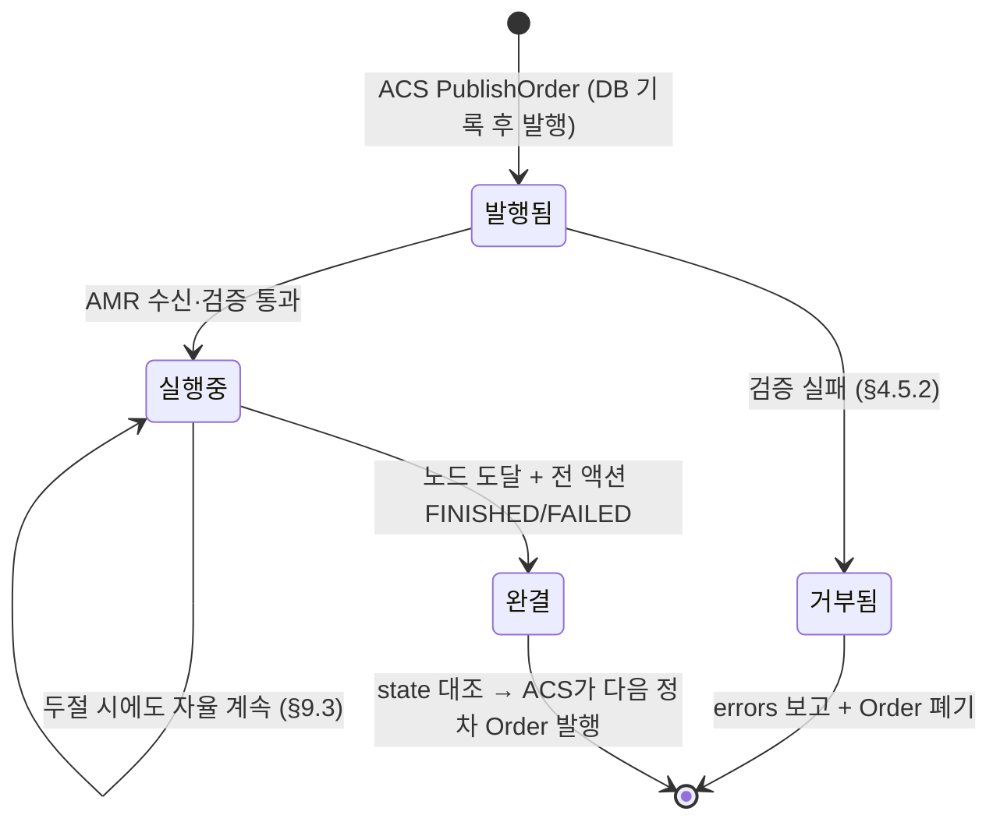
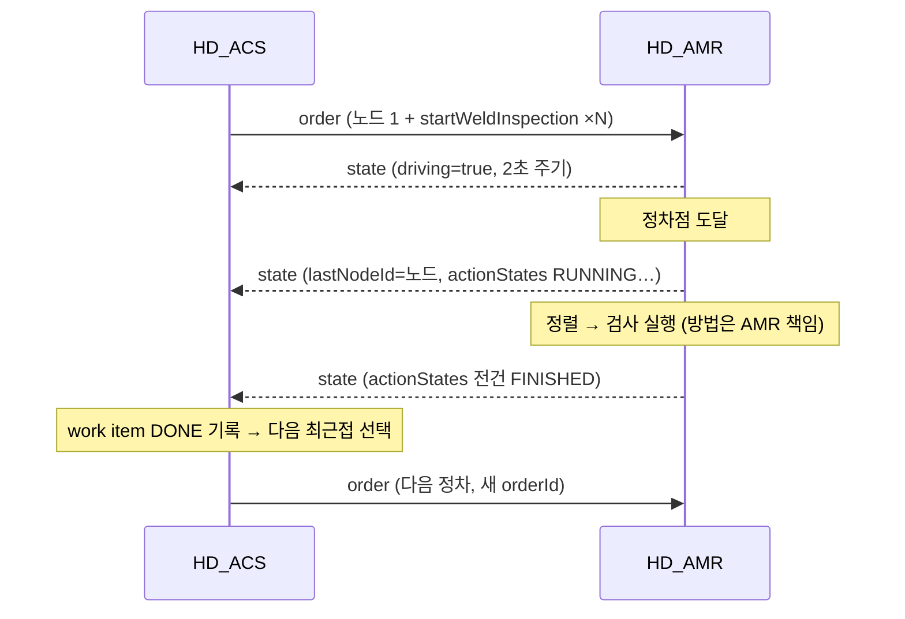
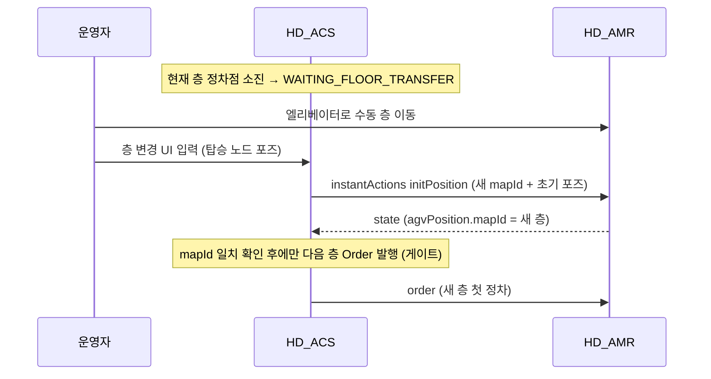

# HD_ACS ↔ HD_AMR VDA 5050 인터페이스 사양서

| 항목 | 내용 |
|---|---|
| 문서 버전 | 1.0 (draft — HD_AMR 협의 전) |
| 작성일 | 2026-08-27 |
| 대상 | HD_AMR 통합 운영 S/W 개발팀 (로봇 온보드) |
| 기준 표준 | **VDA 5050 v2.0** (Interface for the communication between AGV and master control) |
| 상태 | ACS 측 계약 확정판 — `[협의]` 표시 항목은 §10에서 HD_AMR 회신 대기 |

> **이 문서가 인터페이스 계약의 단일 출처(single source of truth)다.**
> 다른 문서(ARCHITECTURE.md, GRAPH_DATA_MODEL.md, SPEC_PHASE2_ACS.md 등)와 기술이 다를 경우 본 사양서가 우선한다.
> 본문은 **계약**을 기술하며, 현행 ACS 구현이 계약과 다른 곳은 각주 `※구현`으로 구분 표기한다.

---

## 1. 개요·범위

### 1.1 단일 상대 원칙 [ADR-001]

HD_ACS(관제)의 로봇측 통신 상대는 **HD_AMR 하나**, 인터페이스는 **VDA 5050 over MQTT 하나**뿐이다.
ACS는 AMR 플랫폼·협동로봇·검사장비를 개별 제어하지 않으며, 자세·검사 시퀀스를 계산하지 않는다.

### 1.2 책임 경계

| | HD_ACS (마스터 컨트롤) | HD_AMR (로봇 온보드) |
|---|---|---|
| 계획 | 검사 시나리오·영역·작업 정의, 정차점·정차각 산출(맵 좌표) | — |
| 배차 | Order 생성·발행(어디로 가서 무엇을 검사할지) | — |
| 실행 | — | 주행, 협동로봇 자세 시퀀스, 검사장비 제어, 검사 실행 방법 일체 |
| 자세 | 전송하지 않음 (Cobot BASE 좌표·티칭 데이터 미전송) | `wall_code` 티칭 기반 툴 자세 결정 |
| 보고 | state 수신·대조·기록·전파 | state 주기 보고, connection 생존 신호 |
| 데이터 | 촬영 명령의 위치·시각·성공/실패 기록 | 이미지 자체는 별도 검사 S/W로 (ACS 미경유) [ADR-004] |

### 1.3 채택 버전

- **VDA 5050 2.0** — 헤더 `version: "2.0.0"`, 토픽 majorVersion `v2`.
- 표준에 없는 검사 동작은 **커스텀 액션**으로 정의한다 (§8).

---

## 2. 전송 계층 (MQTT)

### 2.1 브로커

| 항목 | 값 |
|---|---|
| 브로커 | Mosquitto (현장 이동식 서버 내 배치, 폐쇄망) [ADR-011] |
| 포트 | 1883 (TCP, 평문 — 폐쇄망 전제. TLS/인증 도입 여부 `[협의]`) |
| 클라이언트 ID | ACS: `hd-acs-master` / AMR: 로봇별 고유 ID |

### 2.2 토픽 구조

```
{interfaceName}/{majorVersion}/{manufacturer}/{serialNumber}/{channel}
```

- `interfaceName` = **`uagv`** (고정)
- `majorVersion` = **`v2`** (고정)
- `manufacturer` / `serialNumber` = ACS DB `ref.robot` 등록값과 동일해야 함 (예: `HHI` / `AMR-01`)

예: `uagv/v2/HHI/AMR-01/order`

### 2.3 채널 목록·방향·QoS·retain

| channel | 방향 | QoS | retain | 비고 |
|---|---|---|---|---|
| `order` | ACS → AMR | 1 (AtLeastOnce) | false | 주행+검사 명령 (§4) |
| `instantActions` | ACS → AMR | 1 | false | 즉시 액션 (§5) |
| `state` | AMR → ACS | 1 | false | **2초 주기** + 이벤트 시 즉시 (§6) |
| `connection` | AMR → ACS | 1 | **true** | 생존 신호 + MQTT Last Will (§7) |
| `factsheet` | AMR → ACS | — | — | **예약 채널 (현행 미사용)** — 향후 로봇 능력 조회용. 현행 ACS는 발행/구독하지 않음 |
| `visualization` | — | — | — | **미사용** — 위치는 state.agvPosition으로 충분 (2초 주기) |

### 2.4 Last Will (필수)

AMR은 MQTT 접속 시 다음 Will을 반드시 설정한다:

- Will 토픽: 자신의 `connection` 토픽
- Will payload: `connectionState: "CONNECTIONBROKEN"` 인 connection 메시지
- Will retain: **true**, QoS 1

→ Wi-Fi 두절·프로세스 사망 시 브로커가 대신 CONNECTIONBROKEN을 발행하여 ACS가 두절을 감지한다 [ADR-002].

> ※구현: 시뮬레이터(`HD.Acs.Simulator/Program.cs:46-51`)가 이 규약대로 동작. Will payload의 headerId/timestamp는 접속 시점 값이어도 무방(ACS는 connectionState만 소비).

---

## 3. 공통 메시지 헤더

모든 채널의 payload는 JSON 객체이며 다음 헤더 필드로 시작한다:

```json
{
  "headerId": 42,
  "timestamp": "2026-08-27T04:12:33.427Z",
  "version": "2.0.0",
  "manufacturer": "HHI",
  "serialNumber": "AMR-01"
}
```

| 필드 | 규칙 |
|---|---|
| `headerId` | **토픽별 단조 증가** (uint, 발행 측이 채번) `[협의 N1]` |
| `timestamp` | ISO 8601 UTC. **밀리초 3자리 + `Z`** 형식 권장 `[협의 N2]`. 수신 측은 ISO 8601 오프셋 표기(`+00:00`, 소수 7자리 포함)도 수용해야 한다 |
| `version` | `"2.0.0"` 고정 |
| `manufacturer`, `serialNumber` | 토픽 경로 요소와 동일 값 |

> ※구현(2026-08-28 반영 완료): ACS는 headerId를 **토픽별 단조 증가**로 채번하고 timestamp를 **밀리초+`Z`** 포맷으로 발행한다 — ACS 제안값(N1/N2) 그대로 구현됨. 수신 측은 여전히 오프셋 표기도 수용해야 한다(§3 표).

---

## 4. order (ACS → AMR)

### 4.1 배차 모델 — 정차 단위 단일 노드 Order

ACS는 **greedy 최근접 동적 배차**를 사용한다. 층(맵) 안의 미검사 정차점 중 로봇 최근접 1건을 골라
**노드 1개짜리 Order**를 발행하고, 그 정차의 모든 액션이 종결되면 다음 정차 Order를 발행한다.

- **Order 1건 = 정차점 1개 = OrderNode 1개 (sequenceId=0) + 검사 액션 N개**
- **orderId**: 정차마다 **새 UUID** 발급 (이전 Order는 이미 완결된 상태에서만 다음 Order 수신)
- **orderUpdateId**: 항상 **0** — order update(동일 orderId 갱신) 시맨틱은 사용하지 않는다.
  재시도·변경도 **신규 orderId의 새 Order**로 발행한다
- **released**: 모든 노드/엣지 `true` (Base 전체 릴리즈, **horizon 미사용**) [ADR-002]
- 경로(엣지 시퀀스)는 전송하지 않는다 — 목표 노드까지의 주행 경로는 AMR 자율 판단

> AMR 요건: "현재 Order와 다른 orderId 수신 = 새 임무"로 처리할 것. 이전 Order의 액션이 모두 종결된 뒤에만 새 Order가 오는 것이 ACS 보증이나, 방어적으로는 신규 orderId 수신 시 이전 Order를 폐기해도 무방하다(비상정지·수동 개입 후 재배차 경로).

복수 노드 Order(경로형: sequenceId 노드=짝수 0,2,4… / 엣지=홀수 1,3,5…)는 ACS `OrderBuilder`에 구현되어 있으나 **현행 운영 계약은 단일 노드형**이다. 향후 경로형 전환 시 본 절을 개정한다.

### 4.2 메시지 스키마 (ACS 발행 필드)

```jsonc
{
  // ── 공통 헤더 (§3) ──
  "headerId": 43, "timestamp": "...", "version": "2.0.0",
  "manufacturer": "HHI", "serialNumber": "AMR-01",

  "orderId": "0d9a2c9e-6a1f-4a58-9e1e-1c9f6d2b7a01",   // 정차마다 신규 UUID
  "orderUpdateId": 0,                                    // 항상 0
  "nodes": [
    {
      "nodeId": "b7f0…(workItemId UUID)",   // ACS 발급 — state.lastNodeId로 echo
      "sequenceId": 0,
      "released": true,
      "nodePosition": {
        "x": 12.482, "y": 5.117,            // 맵 좌표 [m]
        "theta": 1.571,                     // [rad], 맵 X축 기준 CCW (부록 B)
        "allowedDeviationXY": 0.08,         // [m]
        "allowedDeviationTheta": 0.07,      // [rad]
        "mapId": "CT1-L2"                   // 층 = 맵 (§4.3)
      },
      "actions": [ /* §8 커스텀 액션 */ ]
    }
  ],
  "edges": []                               // 단일 노드형 — 빈 배열
}
```

- 노드의 `actions`는 검사 액션 배열 — 같은 정차점의 작업 N개가 액션 N개로 실린다. **배열 순서 = 실행 순서.**
- `edges`는 단일 노드형에서 항상 빈 배열. 엣지 객체가 실리는 경우 각 엣지에도 `actions: []`(빈 배열)를 포함한다 `[협의 N3]`
  (※구현 2026-08-28: OrderEdge 모델에 actions 필드 반영 완료 — 빈 배열 직렬화).

### 4.3 맵 = 층 모델

- 화물창은 4층 슬라이스 구조이며 **층 1개 = 맵 1개**: `mapId = "{tankId}-L{n}"` (예: `CT1-L1` … `CT1-L4`).
- ACS는 **로봇이 보고한 층(state.agvPosition.mapId)과 일치하는 Order만 발행**한다 (층 검증 게이트, §9.2).
- 층간 이동(엘리베이터)은 수동 운영 — ACS는 Order로 층 이동을 명령하지 않는다 [Q9].

### 4.4 정차점(nodePosition)의 의미와 산출 (참고)

ACS가 발행하는 `nodePosition`은 다음과 같이 산출된 **벽면 이격 정차점**이다 (ACS 내부 규칙이나, AMR이 목표점의 성격을 이해하는 데 필요해 기재):

```
정차점(x,y) = 검사 영역 중심의 바닥 투영 + (벽 내부향 법선의 수평 성분) × 정차 이격(standoff)
theta       = 벽을 정면으로 바라보는 방향
```

- **정차 이격(기본 0.8 m, 영역별 설정 가능)이 이미 반영되어 있다** — 목표점이 벽면에 붙어 있지 않다.
  이격 값은 "벽면 ↔ 로봇 기준점(중심)" 거리이므로, 실제 차체-벽 여유 = 이격 − 로봇 반폭 − allowedDeviationXY.
- 바닥(B)/천장(T) 영역은 수평 법선이 없어 이격 없이 중심 투영이 오며, 운영자 수동 지정 좌표가 올 수도 있다.
- **책임 경계**: ACS의 정차점은 "목표"일 뿐이며, 접근 경로 계획·장애물(벽 포함) 충돌 회피는 **AMR 자율 주행 책임**이다.
  목표점이 도달 불가하면 진입을 강행하지 말고 `state.errors`(주행 실패 유형)로 보고할 것 (§6.4, §9.5 실패 정책으로 처리).

> AMR 요건: 로봇 실물 치수 확정 시 적정 기본 이격을 ACS에 회신 — 코봇 리치(용접선까지 도달)와 차체-벽 안전 여유를 동시에 만족하는 값 `[협의 N10]`.

### 4.5 Order 수명주기

발행된 Order 1건의 상태 흐름과 양측 책임:



**4.5.1 상태 판정의 주체와 근거**

| 상태 | 판정 주체 | 근거 |
|---|---|---|
| 발행됨 | ACS | Order 발행 직전 DB에 정차·액션 기록 (저장 → 발행 순서) |
| 실행중 | ACS | state의 `orderId` 일치 + `driving`/`actionStates` 진행 보고 |
| 완결 | ACS | `lastNodeSequenceId` ≥ 목표 노드 seq **AND** 해당 Order의 전 액션이 FINISHED/FAILED (§6.2 대조 규칙) — "전 액션 성공"이 아니라 **전 액션 종결**이 완결 조건이며, FAILED 포함 여부는 실패 정책(§9.5)이 처리 |
| 폐기 | AMR | **신규 orderId 수신 = 이전 Order 즉시 폐기** (ACS는 이전 Order 완결 후에만 새 Order를 보내는 것을 보증하나, 비상정지·수동 개입 후 재배차 경로에서는 미완결 상태의 교체가 발생할 수 있음) |

**4.5.2 Order 거부(rejection)** `[협의 N11]`

AMR이 수신한 Order를 실행할 수 없는 경우(모르는 `mapId`, 필수 필드 누락, 파라미터 검증 실패, 현재 층 불일치 등):

- Order를 **폐기**하고(부분 실행 금지), 기존 실행 중 Order가 있으면 그것을 유지한다.
- `state.errors[]`에 거부 사실을 보고한다 — ACS 제안: `errorType: "orderValidationError"`(N6 코드 체계와 함께 확정), `errorLevel: "WARNING"`, `errorDescription`에 거부된 orderId와 사유.
- 개별 **액션** 파라미터만 문제인 경우는 Order 거부가 아니라 해당 액션을 `actionStatus: "FAILED"`로 보고한다 (§9.5 재시도 정책 경로 — 시뮬레이터의 `FAIL;reason=PARAM(...)` 계약이 이 케이스).

> ※구현: 현행 ACS는 Order 거부의 자동 감지·재배차가 미구현이다(거부되면 해당 정차가 DISPATCHED로 남음 — 운영자 개입 필요). N11 확정 후 errors 기반 자동 처리 추가 예정. AMR은 위 계약대로 보고하면 된다.

**4.5.3 취소(cancelOrder) — 미사용**

VDA 5050 표준의 `cancelOrder` instantAction은 **본 프로젝트에서 사용하지 않는다** (AMR은 미구현 가능).
진행 중 작업의 중단은 ① `emergencyStop`(즉시 기능 정지, §5.1) → ② 운영자 판단 → ③ **신규 orderId의 새 Order 재배차**로 처리한다. 단일 노드 Order 모델이라 취소가 필요한 잔여 horizon이 없기 때문이다.

**4.5.4 완결 후 orderId 보고 유지**

정차 완결 후에도 AMR은 **다음 Order를 수신할 때까지** state에 마지막 `orderId`와 최종 `actionStates`를 유지 보고한다 (`""`로 지우지 말 것) — 두절-재접속 시 ACS가 최신 state 1건으로 따라잡는 근거(§9.3). `orderId: ""`는 부팅 후 아직 어떤 Order도 받은 적 없는 상태에만 사용한다.

**4.5.5 ACS 내부 큐와의 대응 (참고)**

Order가 "어디서 오는지": run 시작 시 ACS는 계획(검사 영역·용접선)을 **실행 큐(work_item)**로 일괄 전개하고,
큐 항목별 상태(PENDING → DISPATCHED → DONE / 재큐잉 → SKIPPED)를 자체 관리한다. Order는 큐에서
로봇 최근접 항목을 꺼낼 때마다 생성·발행되며(§4.1), 실패 재시도의 재발행도 이 큐를 거쳐
**"발행됨" 상태로 재진입**한다. 이 발행 전 수명주기는 VDA 5050 계약 범위 밖의 ACS 내부 사양이며,
상세 상태 머신은 `INSPECTION_SCENARIO.md` §3(내부 상태 모델의 정본)을 참조 — AMR은 이 절의
존재만 알면 되고 구현 요건은 없다.

---

## 5. instantActions (ACS → AMR)

```json
{
  "headerId": 44, "timestamp": "...", "version": "2.0.0",
  "manufacturer": "HHI", "serialNumber": "AMR-01",
  "actions": [ { "actionType": "...", "actionId": "UUID", "blockingType": "HARD", "actionParameters": [] } ]
}
```

### 5.1 `emergencyStop`

| 항목 | 값 |
|---|---|
| actionType | `emergencyStop` |
| blockingType | HARD |
| actionParameters | 없음 |
| AMR 요구 동작 | 주행·협동로봇·검사 즉시 정지, 현재 Order/액션 FAILED 또는 중단 보고 |

> ⚠️ **기능적 정지(functional stop)이며 안전 규격(PL/SIL) 정지가 아니다** [ADR-007].
> Wi-Fi/MQTT 경유이므로 지연·유실 가능 — 안전은 로봇 자체 안전 체인이 책임진다.

### 5.2 `initPosition` — 수동 층 전환 후 재측위

| 항목 | 값 |
|---|---|
| actionType | `initPosition` |
| blockingType | HARD |
| actionParameters | `mapId`(string), `x`(m), `y`(m), `theta`(rad) — **평면 key 4개** `[협의 N5]` |
| AMR 요구 동작 | 지정 맵(층)으로 측위 전환 + 초기 포즈로 재측위. 이후 state의 `agvPosition.mapId`를 새 층으로 보고 (§9.2 게이트 해제 조건) |

```json
{ "actionType": "initPosition", "actionId": "…", "blockingType": "HARD",
  "actionParameters": [
    { "key": "mapId", "value": "CT1-L2" },
    { "key": "x", "value": 1.20 }, { "key": "y", "value": 0.80 }, { "key": "theta", "value": 0.0 }
  ] }
```

> `[협의 N5]` VDA 5050 표준 관례는 `pose` 객체 1개(x,y,theta,mapId,lastNodeId)를 파라미터로 쓰는 경우가 많다. ACS 제안은 위의 평면 key 4개 — AMR 파서 선호에 따라 확정한다.

instantAction에 대한 actionState 보고는 선택 사항이다 — ACS는 instantAction의 actionStates를 추적하지 않으며, `initPosition`의 성공 판정은 **state.agvPosition.mapId 변경**으로만 한다.

---

## 6. state (AMR → ACS)

### 6.1 발행 규칙

- **2초 주기** 정기 발행 + 다음 이벤트 시 즉시 발행 권장: 노드 도달, actionStatus 변화, 오류 발생, Order 수신 직후.
- `agvPosition.mapId`는 **필수** — 층 검증 게이트·검사 위치 기록의 근거.

### 6.2 ACS가 소비하는 필드 (최소 계약)

```jsonc
{
  "headerId": 1207, "timestamp": "...", "version": "2.0.0",
  "manufacturer": "HHI", "serialNumber": "AMR-01",

  "orderId": "0d9a2c9e-…",        // 현재(마지막 수신) Order — 없으면 ""
  "orderUpdateId": 0,
  "lastNodeId": "b7f0…",          // 마지막 통과/도달 노드 (Order의 nodeId echo)
  "lastNodeSequenceId": 0,
  "driving": false,
  "agvPosition": {
    "x": 12.48, "y": 5.12, "theta": 1.57,
    "mapId": "CT1-L2",            // ★ 필수 — 층 게이트 근거
    "positionInitialized": true
  },
  "batteryState": { "batteryCharge": 87.5, "charging": false },
  "actionStates": [
    { "actionId": "8f3c19aa-…",   // ★ Order의 actionId 그대로 echo — 대조 키
      "actionType": "startWeldInspection",
      "actionStatus": "FINISHED", // WAITING | INITIALIZING | RUNNING | FINISHED | FAILED
      "resultDescription": "ok" }
  ],
  "nodeStates": [],               // 미도달 잔여 노드 (도달 시 제거)
  "errors": []                    // §6.4
}
```

**핵심 대조 규칙** — ACS는 다음으로 진행 상태를 판정한다:

1. `orderId` 일치 확인 → 해당 미션/정차(work item)와 대조
2. `lastNodeSequenceId` ≥ 목표 노드 seq → 도달 판정
3. `actionStates[].actionId`(ACS가 발급한 UUID의 echo)로 액션별 상태 대조
4. 목표 노드 도달 + 모든 액션 종결(FINISHED/FAILED) → 정차 완료 → 다음 배차
5. `agvPosition.mapId` → 층 게이트·robot_context 갱신

> **actionId·nodeId·sequenceId는 ACS가 발급하며 AMR은 절대 재발급하지 않고 그대로 echo한다.** 이것이 두절-재접속 동기화(robot-is-truth)의 전제다 [ADR-002].

### 6.3 표준 필수 필드의 취급 `[협의 N4]`

VDA 5050 2.0 표준의 state 필수 필드 중 `operatingMode`, `safetyState`, `edgeStates`, `information`, `paused`, `newBaseRequest` 등은 **전송해도 무방하나 현행 ACS는 소비하지 않는다** (ACS 파서는 미지 필드 무시).
AMR이 표준 준수 구현(전체 필드 발행)을 하는 것을 **권장**하며, ACS는 필요 시(예: safetyState.eStop 표시) 소비를 추가한다.

### 6.4 errors

```json
{ "errorType": "INSPECTION_FAILED", "errorLevel": "WARNING", "errorDescription": "..." }
```

- `errorLevel`: `WARNING`(운영 계속 가능) | `FATAL`(임무 수행 불가)
- `errorType` **코드 체계는 HD_AMR이 목록을 제시** `[협의 N6]` — 최소 분류 제안: 주행 실패 / 검사(액션) 실패 / 장비 오류 / 측위 상실.
- ACS 정책: 액션 FAILED·errors 기준 **재시도 N회 → 스킵 → 알람** (§9.5).

> ※구현: 재시도 N회→스킵→알람 정책은 **actionStatus=FAILED 기준으로 동작**(2026-08-28 E2E 검증 — 재큐잉·SKIPPED·INSPECTION_SKIPPED 알람). errors의 **유형 코드별** 정책 분기는 코드 체계 협의(N6) 후 구현 예정 — 현행은 건수만 UI 전파. 계약상 AMR은 위 형식으로 보고하면 된다.

---

## 7. connection (AMR → ACS)

```json
{ "headerId": 3, "timestamp": "...", "version": "2.0.0",
  "manufacturer": "HHI", "serialNumber": "AMR-01",
  "connectionState": "ONLINE" }
```

| connectionState | 발행 주체·시점 | retain |
|---|---|---|
| `ONLINE` | AMR — MQTT 접속 직후 | true |
| `OFFLINE` | AMR — 정상 종료 직전 | true |
| `CONNECTIONBROKEN` | **브로커** — Last Will (비정상 두절) | true |

ACS 반응: ONLINE → 미션 `ConnectionRestored`(RUNNING 복귀 + state 재동기화) / OFFLINE·CONNECTIONBROKEN → 미션 `DISCONNECTED` 표시. **두절 중에도 AMR은 진행 중 Order를 자율 계속 수행한다** — 재접속 후 최신 state 1건으로 ACS가 따라잡는다(robot-is-truth) [ADR-002].

---

## 8. 커스텀 액션 카탈로그

| actionType | scope | blockingType | 용도 |
|---|---|---|---|
| `startWeldInspection` | NODE | HARD | 단일 용접라인 구간 자동 검사 (본 절) |
| `initPosition` | INSTANT | HARD | 재측위 (§5.2) |
| `emergencyStop` | INSTANT | HARD | 기능적 비상정지 (§5.1) |

### 8.1 `startWeldInspection`

정차 노드에 부착되는 검사 액션. AMR은 이 액션 1건 = 용접선 1구간 검사로 실행한다
(정렬 → 자세 시퀀스 → 촬영/측정 — 실행 방법은 전적으로 AMR 책임).

`actionParameters`는 key/value 3쌍 — `jobRef`(string), `position`(object), `params`(object):

| 필드 | 의미 |
|---|---|
| `jobRef` | 작업 역추적 키 (사람이 읽는 ID — AMR은 로깅 외 해석 불요) |
| `position.seamStartW/seamEndW` | 용접선 시작/끝 **맵(월드) 좌표** [x,y,z] m — 도면 좌표에 릴리즈 시점 유효 T_W_D(도면→맵 강체변환) 적용, z는 통과 |
| `position.drawingPos` | 도면 좌표 echo — tank/level/wall_code + **u,v(벽면-로컬)** + x,y,z(도면). `wall_code`가 **티칭 자세 선택 키** |
| `params.seamType` | `LINE` \| `POLYLINE` |
| `params.sectionDxfId` | 단면 프로파일 참조 ID |
| `params.inspectionProfileId` | 검사(촬영/측정) 프로파일 ID |
| `params.standoffMm` | 표면 이격 거리 [mm] |
| `params.workingDistanceMm` | (선택) 작업 거리 [mm] |
| `params.anchorGroupId` | 정렬(anchor) 공유 그룹 — **같은 그룹의 연속 액션은 사이에 주행이 없었다면 정렬 재수행 생략 가능** |
| `params.seqInGroup` | 그룹 내 순번 (1부터) |

`wallNormalW`(벽 법선)는 **전송하지 않는다** — 툴 자세는 AMR이 `wall_code` 티칭으로 결정한다.

### 8.2 param_schema (JSON Schema draft-07 — ACS가 발행 직전 자체 검증)

```json
{
  "type": "object",
  "required": ["jobRef", "position", "params"],
  "properties": {
    "jobRef": { "type": "string" },
    "position": {
      "type": "object",
      "required": ["seamStartW", "seamEndW", "drawingPos"],
      "properties": {
        "seamStartW": { "type": "array", "items": { "type": "number" }, "minItems": 3, "maxItems": 3 },
        "seamEndW":   { "type": "array", "items": { "type": "number" }, "minItems": 3, "maxItems": 3 },
        "drawingPos": {
          "type": "object",
          "required": ["tank", "level", "wall_code", "u", "v", "x", "y", "z"],
          "properties": {
            "tank": { "type": "string" }, "level": { "type": "integer" },
            "wall_code": { "type": "string" },
            "u": { "type": "number" }, "v": { "type": "number" },
            "x": { "type": "number" }, "y": { "type": "number" }, "z": { "type": "number" }
          }
        }
      }
    },
    "params": {
      "type": "object",
      "required": ["seamType", "sectionDxfId", "inspectionProfileId", "standoffMm", "anchorGroupId", "seqInGroup"],
      "properties": {
        "seamType": { "enum": ["LINE", "POLYLINE"] },
        "points": { "type": "array" },
        "sectionDxfId": { "type": "string" },
        "inspectionProfileId": { "type": "string" },
        "standoffMm": { "type": "number" },
        "workingDistanceMm": { "type": "number" },
        "anchorGroupId": { "type": "string" },
        "seqInGroup": { "type": "integer", "minimum": 1 }
      }
    }
  }
}
```

> ※구현(2026-08-28 반영 완료): `drawingPos`의 `u`, `v`와 완전한 `params`(seamType·sectionDxfId·inspectionProfileId·standoffMm·workingDistanceMm·anchorGroupId·seqInGroup)를 ACS가 본 스키마대로 발행하며, **발행 전 자체 스키마 검증**(위반 시 run 시작 거부)도 동작한다. DB 포함 풀 E2E(시뮬레이터)로 검증 완료. AMR 파서는 방어적으로 u,v 부재도 수용 가능하게 구현해도 무방하다.

### 8.3 직렬화 규칙

- `actionParameters[].value`는 **JSON object/number/string 그대로** 직렬화가 기본.
- AMR 파서가 문자열 value만 수용한다면 `position`/`params`를 JSON 문자열로 발행하는 폴백을 협의로 채택할 수 있다 `[협의 N7]` (※구현: 폴백 스위치는 ACS 미구현 — 필요 판정 시 추가).

### 8.4 골든 예시 (액션 전문)

```json
{
  "actionType": "startWeldInspection",
  "actionId": "8f3c19aa-0000-4000-8000-0000000000e2",
  "blockingType": "HARD",
  "actionParameters": [
    { "key": "jobRef", "value": "JOB-CT1-L2-W03-S07-2" },
    { "key": "position", "value": {
        "seamStartW": [12.510, 5.980, 1.420],
        "seamEndW":   [13.310, 5.980, 1.420],
        "drawingPos": { "tank": "CT1", "level": 2, "wall_code": "W03",
                        "u": 3.120, "v": 1.420,
                        "x": 3.120, "y": 0.0, "z": 1.420 } } },
    { "key": "params", "value": {
        "seamType": "LINE",
        "sectionDxfId": "DXF-CORR-T12",
        "inspectionProfileId": "INSPECT-STD-01",
        "standoffMm": 400,
        "workingDistanceMm": 400,
        "anchorGroupId": "CT1-L2-W03-ST04",
        "seqInGroup": 2 } }
  ]
}
```

노드측 `nodePosition`: `{ "x": 12.482, "y": 5.117, "theta": 1.571, "mapId": "CT1-L2", "allowedDeviationXY": 0.08, "allowedDeviationTheta": 0.07 }`

---

## 9. 운영 시퀀스

### 9.1 정상 검사 플로우 (정차 단위 배차)



### 9.2 층 전환 (수동 엘리베이터 + 검증 게이트)



### 9.3 두절 / 재접속 [ADR-002]

1. 두절 → 브로커가 Last Will `CONNECTIONBROKEN`(retain) 발행 → ACS: 미션 DISCONNECTED 표시.
2. **AMR은 진행 중 Order를 자율 계속 수행** (검사 계속, 결과 로컬 보존).
3. 재접속 → AMR `ONLINE` 발행 + 최신 state 즉시 발행.
4. ACS는 state의 `orderId/lastNodeId/actionStates`를 그대로 믿고 DB를 따라잡는다 (**robot-is-truth** — ACS가 발급·보존한 actionId/sequenceId가 대조 키).
5. 두절 구간의 검사 이력(개별 타임스탬프) 소급 재전송은 표준 범위 밖 — 최신 state 스냅샷으로 충분한 것을 기본 계약으로 하며, 상세 이력 필요 시 확장 협의 `[협의 N8]`.

### 9.4 비상정지

ACS `emergencyStop` instantAction 발행(§5.1) → AMR 즉시 정지 + state로 정지 상태 보고. 재개는 운영자 판단으로 신규 Order 재배차 (order update 아님).

### 9.5 실패 처리

- 액션 `FAILED` 보고 → ACS: 검사 실패 기록 → **재시도 N회(신규 orderId 재발행) → 스킵 → 알람** 정책.
- AMR 요건: 실패 시 `actionStatus: "FAILED"` + `resultDescription`, 가능하면 `errors[]`에 유형 코드 병기. 같은 정차의 잔여 액션 계속 여부는 AMR 판단이되 각 액션 상태를 개별 보고할 것.

---

## 10. 협의 항목 (HD_AMR 회신 요청)

본문에서 `[협의]`로 표시한 항목. **회신 전까지는 "ACS 제안"이 잠정 계약**이다.

| # | 항목 | ACS 제안 | 배경 | HD_AMR 회신 |
|---|---|---|---|---|
| N1 | headerId 채번 | 토픽별 단조 증가 (ACS 구현 완료) | 표준은 토픽별 증가 | |
| N2 | timestamp 포맷 | ISO 8601 UTC 밀리초+`Z` (ACS 구현 완료, 수신은 오프셋 표기도 수용) | 표준 예시 포맷 | |
| N3 | edge.actions | 엣지 실릴 경우 빈 배열 포함 (ACS 구현 완료, 단일 노드형에선 무관) | 표준 required 필드 | |
| N4 | state 표준 필수 필드 (operatingMode/safetyState/edgeStates/information 등) | AMR 표준대로 발행 권장, ACS는 §6.2 최소 계약만 소비 | ACS 파서는 미지 필드 무시 | |
| N5 | initPosition 파라미터 | 평면 key: mapId/x/y/theta | 표준 관례는 pose 객체 | |
| N6 | errors.errorType 코드 체계 | AMR이 코드 목록 제시 (최소: 주행/검사/장비/측위) | 재시도·스킵 정책 분기 근거 | |
| N7 | actionParameters.value 직렬화 | JSON object 그대로 (문자열 아님) | AMR 파서 제약 시 문자열 폴백 협의 | |
| N8 | 두절 구간 상세 이력 | 최신 state 스냅샷으로 충분 (소급 재전송 없음) | 표준 범위 밖 확장 | |
| N9 | MQTT 보안 | 평문 :1883 (폐쇄망 전제) | TLS/계정 필요 여부 | |
| N10 | 정차 이격(standoff) 적정값 | 기본 0.8 m (벽면↔로봇 중심, 영역별 조정 가능) | 로봇 실물 치수·코봇 리치 기준으로 AMR이 적정값 회신 (§4.4) | |
| N11 | Order 거부 보고 방식 | 폐기 + errors에 `orderValidationError`(orderId·사유 명시), 액션 단위 문제는 actionStatus FAILED로 구분 (§4.5.2) | N6 코드 체계와 함께 확정 | |

---

## 부록 A. 골든 메시지 전문

### A.1 order (단일 정차 + 검사 액션 1건)

```json
{
  "headerId": 43,
  "timestamp": "2026-08-27T04:12:33.427Z",
  "version": "2.0.0",
  "manufacturer": "HHI",
  "serialNumber": "AMR-01",
  "orderId": "0d9a2c9e-6a1f-4a58-9e1e-1c9f6d2b7a01",
  "orderUpdateId": 0,
  "nodes": [
    {
      "nodeId": "b7f04b1e-3c2d-4e5f-8a9b-0c1d2e3f4a5b",
      "sequenceId": 0,
      "released": true,
      "nodePosition": { "x": 12.482, "y": 5.117, "theta": 1.571,
                        "allowedDeviationXY": 0.08, "allowedDeviationTheta": 0.07,
                        "mapId": "CT1-L2" },
      "actions": [ { "actionType": "startWeldInspection",
                     "actionId": "8f3c19aa-0000-4000-8000-0000000000e2",
                     "blockingType": "HARD",
                     "actionParameters": [ "…§8.4 전문과 동일…" ] } ]
    }
  ],
  "edges": []
}
```

### A.2 state (검사 완료 보고)

```json
{
  "headerId": 1207,
  "timestamp": "2026-08-27T04:14:02.114Z",
  "version": "2.0.0",
  "manufacturer": "HHI",
  "serialNumber": "AMR-01",
  "orderId": "0d9a2c9e-6a1f-4a58-9e1e-1c9f6d2b7a01",
  "orderUpdateId": 0,
  "lastNodeId": "b7f04b1e-3c2d-4e5f-8a9b-0c1d2e3f4a5b",
  "lastNodeSequenceId": 0,
  "driving": false,
  "agvPosition": { "x": 12.48, "y": 5.12, "theta": 1.57,
                   "mapId": "CT1-L2", "positionInitialized": true },
  "batteryState": { "batteryCharge": 87.5, "charging": false },
  "actionStates": [ { "actionId": "8f3c19aa-0000-4000-8000-0000000000e2",
                      "actionType": "startWeldInspection",
                      "actionStatus": "FINISHED",
                      "resultDescription": "ok" } ],
  "nodeStates": [],
  "errors": []
}
```

### A.3 connection (ONLINE)

```json
{ "headerId": 3, "timestamp": "2026-08-27T04:10:00.000Z", "version": "2.0.0",
  "manufacturer": "HHI", "serialNumber": "AMR-01", "connectionState": "ONLINE" }
```

## 부록 B. 좌표·단위 규약

| 항목 | 규약 |
|---|---|
| VDA 5050 전송 구간 단위 | **m / rad** (mm·deg 금지) |
| theta | 맵 X축 기준 **CCW 라디안** |
| 맵 좌표(월드) | 층별 SLAM 맵 프레임 — `mapId`로 층 식별 (`{tank}-L{n}`) |
| 도면 좌표 | ACS 내부 프레임 — 층별 강체변환 T_W_D(기준점 캡처로 산출)로 맵 좌표 변환 후 전송. AMR은 도면 좌표를 해석할 필요 없음 (`drawingPos`는 기록·티칭 키용 echo) |
| u,v | 벽면-로컬 2D 좌표 (u=수평, v=수직, 원점=벽면 좌하단) — echo 정보 |
| m↔mm 환산 | 로봇 온보드 한 곳으로 통일 (standoffMm 등 `*Mm` 필드만 mm) |

## 부록 C. AMR 구현 체크리스트

- [ ] MQTT 접속: clientId 고유, **Last Will = connection/CONNECTIONBROKEN/retain** (§2.4)
- [ ] 접속 직후 `connection ONLINE`(retain) 발행 (§7)
- [ ] `order`·`instantActions` 구독 (QoS 1) — manufacturer/serialNumber 자기 토픽 (§2.2)
- [ ] `state` 2초 주기 + 이벤트 즉시 발행, **agvPosition.mapId 필수** (§6.1)
- [ ] orderId 변경 = 새 임무, actionId/nodeId **echo만** (재발급 금지) (§4.1, §6.2)
- [ ] `startWeldInspection` 핸들러: §8.1 파라미터 해석, wall_code 티칭 자세, anchorGroup 정렬 캐시(무효화: 주행 발생/보정 실패/그룹 변경/신규 Order) (§8)
- [ ] `initPosition`: 층 전환 재측위 → mapId 보고 갱신 (§5.2)
- [ ] `emergencyStop`: 즉시 기능 정지 + 상태 보고 (§5.1)
- [ ] 실패 시 actionStatus FAILED + resultDescription (+ errors 유형 코드) (§9.5)
- [ ] 두절 중 진행 Order 자율 계속 + 재접속 시 최신 state 즉시 발행 (§9.3)
- [ ] orderId 수명주기: 신규 orderId=이전 폐기, 완결 후 마지막 orderId·actionStates 유지 보고, 거부 시 errors 보고 (§4.5)
- [ ] §10 협의 항목 N1~N11 회신
